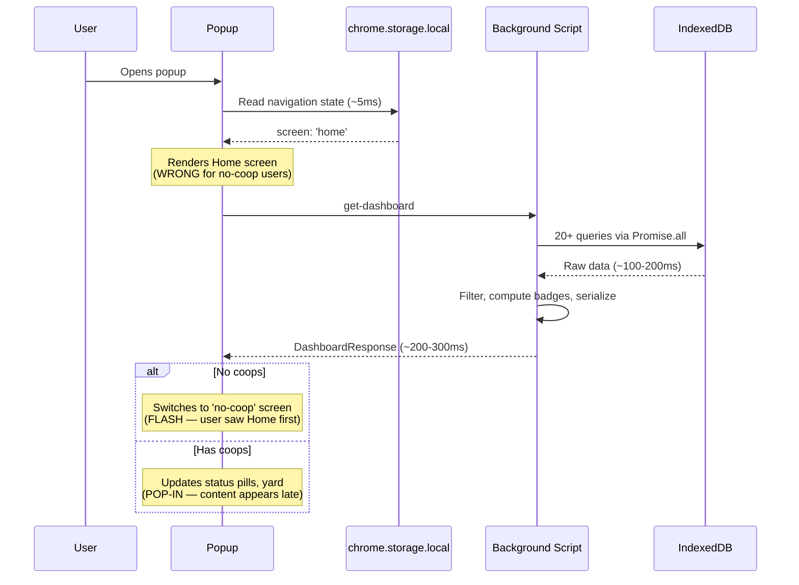
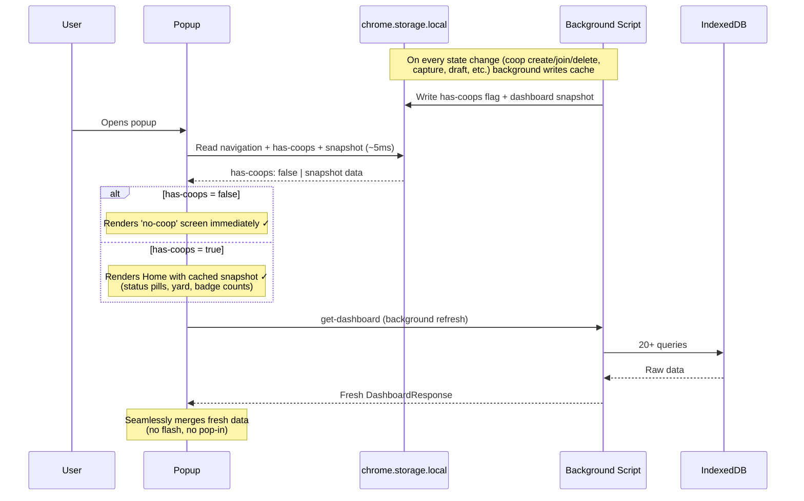
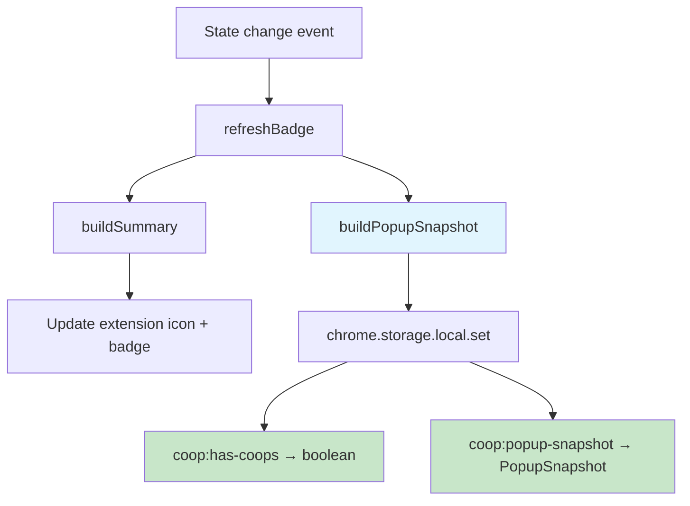
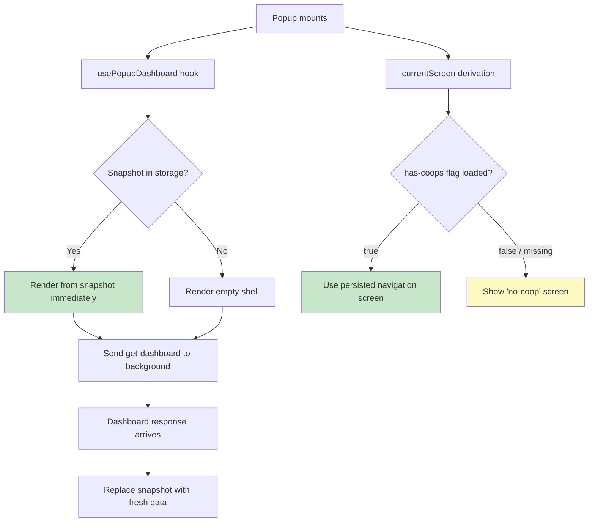

# Popup Optimistic UI — Instant Screen Routing & Cached Snapshot

**Branch**: `fix/popup-optimistic-ui`
**Status**: ACTIVE
**Created**: 2026-03-21
**Last Updated**: 2026-03-21

## Problem

The popup has a 100-300ms window between mount and dashboard response where it shows the wrong UI:
- **No-coop users** see the Home screen (chicken yard, Round Up, footer tabs) before it switches to the welcome screen
- **Has-coop users** see empty status pills (0, "Never") and an empty yard before data fills in

Root cause: the popup's only data source for "has coops?" is the full `DashboardResponse`, which requires 20+ IndexedDB queries in the background script. During that fetch, the popup falls back to the persisted navigation screen (`'home'`).

## Solution: Two-Layer Cache

### Layer 1 — `has-coops` flag (instant screen routing)

A boolean written to `chrome.storage.local` by the background script whenever coops are created, joined, or deleted. The popup reads this alongside its navigation state (~5ms), so it knows which screen to show **before** the dashboard loads.

### Layer 2 — Dashboard snapshot (optimistic content)

A minimal subset of the last successful `DashboardResponse` written to `chrome.storage.local` by the background script after every dashboard build. The popup hydrates from this snapshot on mount, then seamlessly replaces it when the fresh dashboard arrives.

## Decision Log

| # | Decision | Rationale |
|---|----------|-----------|
| 1 | Cache in `chrome.storage.local`, not background memory | Service worker can restart; storage survives |
| 2 | Background writes the cache, popup only reads | Single writer avoids race conditions |
| 3 | Write cache in `refreshBadge()` | Already called on every state change (16+ sites); no new call sites needed |
| 4 | Snapshot is a flat subset, not the full DashboardResponse | Full response is large (coops contain artifacts, CRDT state); snapshot should be <2KB |
| 5 | Popup renders snapshot immediately, no loading state | User asked to remove "Loading popup..." text; optimistic UI avoids needing it |
| 6 | Remove `!loading` from currentScreen derivation | With the has-coops flag available synchronously, we no longer need to gate on dashboard loading |

## Data Flow Diagrams

### Current Flow (BROKEN)



### New Flow (FIXED)



### Cache Write Flow



### Popup Hydration Flow



## Snapshot Shape

```typescript
interface PopupSnapshot {
  /** Whether any coops exist — the critical routing signal */
  hasCoops: boolean;
  /** Coop count for badge/status display */
  coopCount: number;
  /** Coop names for filter dropdowns and labels */
  coopOptions: Array<{ id: string; name: string }>;
  /** Active coop ID for scoped views */
  activeCoopId?: string;
  /** Sync status for the status strip */
  syncLabel: string;
  syncTone: 'ok' | 'warning' | 'error';
  syncDetail: string;
  /** Counts for status pills and footer badges */
  draftCount: number;
  artifactCount: number;
  /** Last capture timestamp for "Roundup" pill */
  lastCaptureAt?: string;
  /** Written timestamp so popup can judge staleness */
  cachedAt: string;
}
```

This is ~500 bytes vs the full `DashboardResponse` which includes CRDT-encoded coop state, arrays of drafts/artifacts/routings, and operator data.

## CLAUDE.md Compliance

- [x] No new shared modules — changes are extension-only
- [x] No new env vars
- [x] Single chrome.storage.local writer (background script)
- [x] Error handling: stale/missing snapshot gracefully falls back to fresh fetch

## Impact Analysis

### Files to Modify

| File | Change |
|------|--------|
| `packages/extension/src/background/dashboard.ts` | Add `writePopupSnapshot()` function; call from `refreshBadge()` |
| `packages/extension/src/views/Popup/hooks/usePopupDashboard.ts` | Read snapshot on mount; use as initial state; merge with fresh dashboard |
| `packages/extension/src/views/Popup/PopupApp.tsx` | Remove `!loading` from `currentScreen`; derive from snapshot's `hasCoops` |
| `packages/extension/src/runtime/messages.ts` | Add `PopupSnapshot` interface |
| `packages/extension/src/background/handlers/coop.ts` | Call `writePopupSnapshot()` after coop create/join (already calls `refreshBadge`, so covered) |

### Files to Create

None — all changes are modifications to existing files.

## Test Strategy

- **Unit tests**: Update `PopupApp.test.tsx` to verify:
  - No-coop state renders welcome screen immediately (no Home flash)
  - Snapshot data renders optimistically before dashboard loads
  - Fresh dashboard data replaces snapshot seamlessly
- **Unit tests**: Add test for `writePopupSnapshot()` in dashboard tests
- **Manual verification**: Open popup after reset — should show welcome immediately; open popup with coop — should show populated Home immediately

## Implementation Steps

### Step 1: Define PopupSnapshot type
**Files**: `packages/extension/src/runtime/messages.ts`
**Details**: Add the `PopupSnapshot` interface. Add storage key constant.

### Step 2: Write snapshot from background
**Files**: `packages/extension/src/background/dashboard.ts`
**Details**:
- Add `writePopupSnapshot()` that takes a `RuntimeSummary` + coops list and writes `PopupSnapshot` to `chrome.storage.local` under key `coop:popup-snapshot`
- Call `writePopupSnapshot()` at the end of `refreshBadge()` (after `buildSummary()` completes — data is already available, no extra DB queries)

### Step 3: Read snapshot in usePopupDashboard
**Files**: `packages/extension/src/views/Popup/hooks/usePopupDashboard.ts`
**Details**:
- On mount, read `coop:popup-snapshot` from `chrome.storage.local` alongside the dashboard fetch
- If snapshot exists, seed `dashboard` state with a synthetic `DashboardResponse`-compatible object (enough to render status pills, badge counts, and yard)
- When real dashboard arrives, replace entirely

### Step 4: Fix currentScreen derivation
**Files**: `packages/extension/src/views/Popup/PopupApp.tsx`
**Details**:
- Read `hasCoops` from the snapshot (available at ~5ms) instead of only from the dashboard response
- Remove the `!loading` guard from line 334 — with the snapshot providing `hasCoops` synchronously, this guard is no longer needed
- The derivation becomes: `!hasCoops && !['create', 'join'].includes(screen) ? 'no-coop' : screen`

### Step 5: Update tests
**Files**: `packages/extension/src/views/Popup/__tests__/PopupApp.test.tsx`, `packages/extension/src/background/__tests__/dashboard.test.ts`
**Details**:
- Test that `writePopupSnapshot` produces correct shape
- Test that PopupApp renders no-coop screen when snapshot says `hasCoops: false`
- Test that PopupApp renders home with snapshot data before dashboard loads

### Step 6: Validate
**Details**: `bun format && bun lint && bun run test && bun build`

## Validation

- [ ] TypeScript passes
- [ ] Tests pass
- [ ] Build succeeds
- [ ] Manual: popup opens instantly to correct screen after reset
- [ ] Manual: popup opens instantly with cached data when coops exist
- [ ] Manual: fresh dashboard data replaces snapshot without flash
