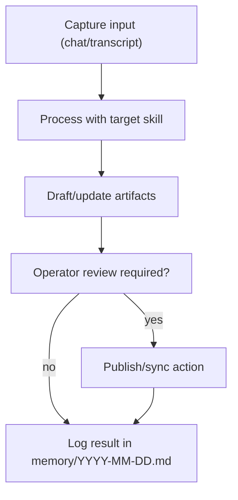
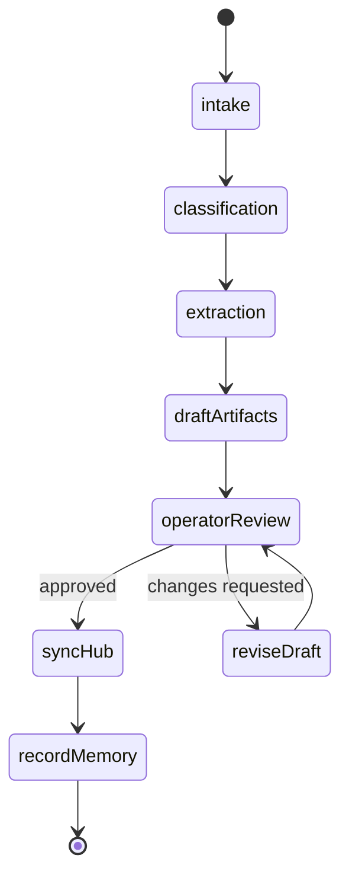

# Council Workflow Test Scenarios

**Testing the Regen Coordination agent with real council workflows**

These scenarios test the integration of Organizational OS v3.0 with OpenClaw against actual Regen Coordination council workflows from the 2026-02-20 sync.

Diagram standards: [DIAGRAM-STANDARDS.md](./DIAGRAM-STANDARDS.md)

---

## Test Setup

**Node:** ReFi BCN DePIN / VPS  
**Agent:** OpenClaw with organizational-os workspace  
**Skills:** meeting-processor, funding-scout, knowledge-curator, capital-flow  
**Channels:** Telegram (council group)

## Test Matrix

### ASCII Map

```text
Scenario | Primary Channel | Core Skill         | Primary Artifact
---------+-----------------+--------------------+-------------------------------
1        | Telegram        | meeting-processor  | packages/operations/meetings/*
2        | Telegram        | funding-scout      | data/funding-opportunities.yaml
3        | Telegram        | heartbeat-monitor  | HEARTBEAT.md
4        | Telegram        | capital-flow       | IDENTITY.md + TOOLS.md + Safe API
5        | Telegram        | knowledge-curator  | knowledge/<domain>/*.md
6        | Telegram + Git  | knowledge-curator  | hub sync commits / actions
```

### Mermaid Flow



---

## Scenario 1: Council Meeting Processing

**Trigger:** After every Friday council call  
**Input:** Raw transcript from Granola or Google Meet  
**Expected Output:** Structured meeting note in `packages/operations/meetings/`

### Test with 2026-02-20 Transcript

Send to agent:
```
Please process this meeting transcript from today's Regen Coordination Council Sync:

[paste 260220 Regen Coordination Council Sync.md transcript]
```

**Success criteria:**
- [ ] Note created at `packages/operations/meetings/260220 Regen Coordination Council Sync.md`
- [ ] Frontmatter includes `categories: [Meetings]` and `projects:` links
- [ ] Key decisions extracted (GitHub org creation, OpenClaw selection, domain pools)
- [ ] Action items extracted with owners and context
- [ ] Discussion summary is concise (not transcript verbatim)
- [ ] Memory updated at `memory/2026-02-20.md`
- [ ] `HEARTBEAT.md` updated with time-sensitive items

### Expected Key Decisions to Extract
- Created regen-coordination GitHub organization
- Selected OpenClaw as agent runtime
- Domain-based approach for first funding pool (waste management, regen finance)
- Impact Stake 1/3-1/3-1/3 split proposal under evaluation
- Artisan Season 6 preparation needed

### Expected Action Items to Extract
- [ ] Follow up with Benjamin Life after break (Luiz)
- [ ] Prepare Impact Stake proposal draft (Council)
- [ ] Check Superfluid Season 6 status (someone)
- [ ] Set up VPS cluster for agent deployment (Luiz)

---

## Scenario 2: Funding Opportunity Scan

**Trigger:** Weekly scan + on-demand query  
**Input:** Query in Telegram  
**Expected Output:** Ranked list of opportunities with deadlines

### Test Query

```
What funding opportunities are available for us right now? 
We're focused on regenerative finance and knowledge commons.
```

**Success criteria:**
- [ ] Agent reads `data/funding-opportunities.yaml`
- [ ] Returns list ranked by deadline
- [ ] Includes Artisan Season 6 (upcoming)
- [ ] Includes Octant (quarterly)
- [ ] Includes Impact Stake (ongoing)
- [ ] Suggests which match org's declared domains
- [ ] Does NOT add to HEARTBEAT without asking
- [ ] Does NOT submit any applications

### Expected Response Structure
```
Here's what's available for regen finance and knowledge commons work:

**Urgent (next 30 days)**
- [If any with near deadline]

**Active/Ongoing**
- Artisan: Season 6 preparing (watch for launch date)
- Octant: Quarterly distribution — next epoch TBD
- Impact Stake: Ongoing yield staking (exploring 1/3-1/3-1/3 model with council)
- Spinach: Monthly renewal active — check renewal date

**Explore**
- Superfluid Season 6: Status unclear — need to check what carries over from Season 5

Which would you like to explore further or track in HEARTBEAT?
```

---

## Scenario 3: Heartbeat Check

**Trigger:** Proactive (every 30 min) or on-demand  
**Input:** Startup or explicit request  
**Expected Output:** Prioritized task list from `HEARTBEAT.md`

### Test Query

```
What's on the heartbeat? Any urgent items?
```

**Success criteria:**
- [ ] Agent reads `HEARTBEAT.md`
- [ ] Returns tasks organized by urgency (critical/urgent/upcoming)
- [ ] Identifies any overdue items
- [ ] Does NOT modify HEARTBEAT without asking
- [ ] Response is concise (not a full file dump)

---

## Scenario 4: Treasury State Query

**Trigger:** On-demand before financial discussions  
**Input:** Query in Telegram  
**Expected Output:** Treasury summary from Safe API

### Test Query

```
What's the current treasury state? I need to know before we discuss the Impact Stake proposal.
```

**Success criteria:**
- [ ] Agent reads Safe address from `IDENTITY.md`
- [ ] Reads endpoint from `TOOLS.md`
- [ ] Returns balance summary (XDAI, any tokens)
- [ ] Lists pending transactions
- [ ] Does NOT propose or execute any transactions
- [ ] Offers to prepare transaction data if asked

---

## Scenario 5: Knowledge Curation

**Trigger:** After meeting mentions interesting resources  
**Input:** Post-meeting curation request  
**Expected Output:** Domain curation file + memory update

### Test Query

```
Can you curate the key knowledge from today's meeting? 
Focus on regenerative finance and knowledge infrastructure domains.
```

**Success criteria:**
- [ ] Agent creates `knowledge/regenerative-finance/2026-02-20.md`
- [ ] Creates `knowledge/knowledge-infrastructure/2026-02-20.md`
- [ ] Extracts Benjamin Life mention (bioregional knowledge commons)
- [ ] Extracts StreamVote mention (trust-graph governance)
- [ ] Extracts Earth.live updates
- [ ] Sources each item
- [ ] Does NOT include personal/private information

---

## Scenario 6: Federation Hub Sync

**Trigger:** After curation, push to hub  
**Input:** Explicit request  
**Expected Output:** Knowledge pushed to hub repo

### Test Query

```
Can you sync today's curations to the hub?
```

**Success criteria:**
- [ ] Agent reads `federation.yaml` for hub location
- [ ] Identifies files to sync (today's curations from `knowledge/`)
- [ ] Shows operator what will be synced before doing it
- [ ] After approval: executes git push to hub (or runs GitHub Action)
- [ ] Confirms sync complete

---

## Integration Test: Full Council Workflow

**Scenario:** Complete Friday council call workflow end-to-end

1. Council call ends (Google Meet recording + Granola transcript ready)
2. Agent receives transcript in Telegram
3. Agent processes → meeting note created, action items extracted
4. Agent curates knowledge → domain files created
5. Agent checks HEARTBEAT → reports urgent items
6. Agent syncs to hub (on approval)
7. Human reviews and approves treasury items in HEARTBEAT

**Time target:** Full cycle within 15 minutes of call ending.

---

## Workflow State Model



### Operational Notes

- Each scenario should end with a recorded PASS/FAIL/PARTIAL result in daily memory.
- Sync actions must always pass explicit operator approval.
- Failures should include cause, missing dependency, and retry plan.

---

## Pass/Fail Recording

After each test, record results in `memory/YYYY-MM-DD.md`:

```markdown
## Agent Test Results — YYYY-MM-DD

### Scenario 1: Meeting Processing
- Result: PASS / FAIL / PARTIAL
- Notes: [any issues]

### Scenario 2: Funding Scan
- Result: PASS / FAIL / PARTIAL
- Notes: [any issues]
...
```

## Known Limitations (pre-launch)

- Google Meet integration: requires Granola or manual transcript paste
- Hub sync: requires GitHub PAT with push access to hub repo
- Safe API: read-only; transactions require Safe UI for signing
- KOI-net: not yet deployed; knowledge sync is Git-based only
