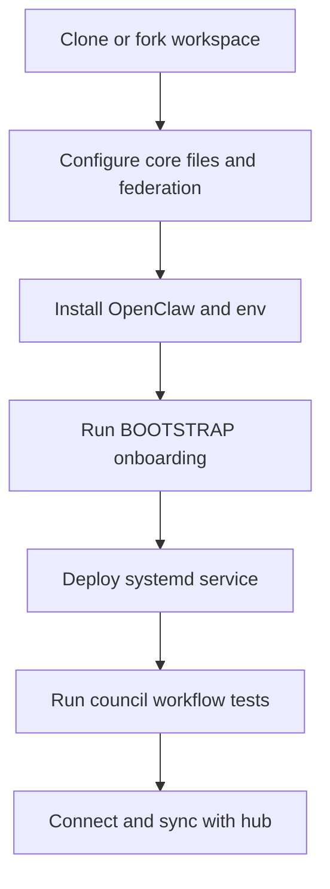
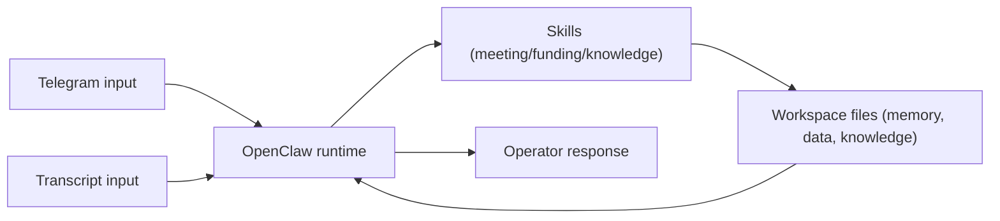

# Pilot Deployment Guide

**Deploy OpenClaw with Organizational OS on ReFi BCN DePIN Node**

This guide walks through deploying the first fully operational Regen Coordination node using OpenClaw as the agent runtime on a DePIN or VPS server.

Diagram standards: [DIAGRAM-STANDARDS.md](./DIAGRAM-STANDARDS.md)

---

## Deployment Topology

### ASCII Map

```text
Operator
  |
  | Telegram / CLI prompts
  v
ReFi BCN Node Workspace (/opt/refi-bcn)
  |-- SOUL.md / IDENTITY.md / USER.md / TOOLS.md
  |-- federation.yaml
  |-- skills/
  |-- memory/
  `-- openclaw.json + .env
        |
        | runtime
        v
     OpenClaw Agent Service (systemd)
        |
        +--> Telegram channels
        +--> LLM provider API
        +--> Safe API (read)
        `--> Regen Coordination Hub repo sync
```

### Mermaid Flow



---

## Prerequisites

### Hardware
- DePIN node OR VPS (minimum: 2 vCPU, 4GB RAM, 20GB storage)
- Ubuntu 22.04 or later
- Outbound internet access

### Software
- Node.js 22+
- Git
- Docker (optional, for containerized deployment)

### Credentials Needed
- Telegram Bot Token (from @BotFather)
- GitHub Personal Access Token (for workspace sync)
- OpenAI API key (for agent LLM)
- Safe API access (no key needed, public API)

---

## Step 1: Clone the Node Workspace

```bash
# On your server
git clone https://github.com/regen-coordination/refi-bcn /opt/refi-bcn
cd /opt/refi-bcn

# Install dependencies
npm install
```

If the node workspace doesn't exist yet, fork from template:
```bash
git clone https://github.com/organizational-os/organizational-os-template /opt/refi-bcn
cd /opt/refi-bcn
npm install

# Run setup
npm run setup
# Answer: ReFi BCN | LocalNode | refi-bcn.github.io | regen-coordination | 🌱 | openclaw
```

---

## Step 2: Configure the Workspace

### SOUL.md
Edit to reflect ReFi BCN's mission and values:
```bash
nano SOUL.md
```

### IDENTITY.md
Fill in:
- Name: ReFi BCN
- Chain: eip155:100
- Safe: 0x... (BCN Safe address)
- Hats Tree ID: (if configured)
- daoURI: https://refi-bcn.github.io/.well-known/dao.json
- Network: regen-coordination

### USER.md
Fill in operator profile (Luiz Fernando).

### TOOLS.md
```markdown
## Telegram Channels to Monitor
- BCN Council: @refibcn_council (private)
- BCN Community: @refibcn (public)

## Safe Config
- Gnosis Chain API: https://safe-transaction-gnosis.gateway.gnosis.io
- Primary Safe: 0x... (from IDENTITY.md)

## RPC Endpoints
- Gnosis Chain: https://rpc.gnosis.gateway.fm
```

### federation.yaml
Verify:
- `network: regen-coordination`
- `hub: github.com/regen-coordination/regen-coordination-os`
- `agent.runtime: openclaw`
- `agent.channels: [telegram, google-meet, github]`
- `agent.proactive: true`
- `agent.heartbeat_interval: "30m"`

---

## Step 3: Install OpenClaw

```bash
# Install OpenClaw globally
npm install -g openclaw

# Verify installation
openclaw --version
```

---

## Step 4: Configure OpenClaw

Create OpenClaw configuration pointing at the workspace:

```bash
cat > /opt/refi-bcn/openclaw.json << 'EOF'
{
  "workspace": "/opt/refi-bcn",
  "channels": {
    "telegram": {
      "bot_token": "${TELEGRAM_BOT_TOKEN}",
      "allowed_groups": [
        "YOUR_BCN_COUNCIL_GROUP_ID",
        "YOUR_BCN_COMMUNITY_GROUP_ID"
      ]
    }
  },
  "llm": {
    "provider": "openai",
    "model": "gpt-4o",
    "api_key": "${OPENAI_API_KEY}"
  },
  "memory": {
    "backend": "hybrid",
    "path": "/opt/refi-bcn/memory"
  },
  "proactive": {
    "enabled": true,
    "heartbeat_interval": "30m"
  }
}
EOF
```

---

## Step 5: Set Environment Variables

```bash
cat > /opt/refi-bcn/.env << 'EOF'
TELEGRAM_BOT_TOKEN=your_bot_token_here
OPENAI_API_KEY=your_openai_key_here
GITHUB_TOKEN=your_github_pat_here
EOF

# Never commit .env to git
echo ".env" >> /opt/refi-bcn/.gitignore
```

---

## Step 6: Run BOOTSTRAP.md Ritual

First, start an interactive session:

```bash
openclaw chat --workspace /opt/refi-bcn
```

In the chat, say:
> "Please run the BOOTSTRAP.md onboarding ritual. I'm setting up ReFi BCN's agent for the first time."

The agent will:
1. Read all workspace files
2. Check system connections
3. Initialize memory
4. Create the first daily log
5. Confirm operational status

---

## Step 7: Deploy as System Service

```bash
sudo cat > /etc/systemd/system/openclaw.service << 'EOF'
[Unit]
Description=OpenClaw Agent — ReFi BCN
After=network.target

[Service]
Type=simple
User=ubuntu
WorkingDirectory=/opt/refi-bcn
EnvironmentFile=/opt/refi-bcn/.env
ExecStart=/usr/bin/openclaw start --config /opt/refi-bcn/openclaw.json
Restart=on-failure
RestartSec=30

[Install]
WantedBy=multi-user.target
EOF

sudo systemctl enable openclaw
sudo systemctl start openclaw
sudo systemctl status openclaw
```

---

## Step 8: Test Council Workflows

### Test 1: Meeting Processing

Send the agent a meeting transcript in Telegram:
```
@[bot_username] Can you process this meeting? [paste transcript]
```

Expected: Agent processes transcript, writes to `packages/operations/meetings/`, updates memory.

### Test 2: Funding Scout

Ask in Telegram:
```
@[bot_username] What funding opportunities are available for us?
```

Expected: Agent reads `data/funding-opportunities.yaml`, checks hub, returns ranked list.

### Test 3: Heartbeat Check

Ask in Telegram:
```
@[bot_username] What's the status of our active tasks?
```

Expected: Agent reads `HEARTBEAT.md`, reports urgent, upcoming, and overdue tasks.

---

## Runtime Data Flow

### Mermaid Flow



### Operational Notes

- All scenario outputs should be traceable to `skills/`, `data/`, and `memory/`.
- Keep runtime channels and credentials in sync with `TOOLS.md` and `.env`.
- Validate each tested path in `docs/COUNCIL-WORKFLOW-TESTS.md`.

---

## Step 9: Connect to Federation Hub

```bash
cd /opt/refi-bcn

# Add hub as git remote
git remote add hub https://github.com/regen-coordination/regen-coordination-os

# Pull shared skills
git fetch hub
git checkout hub/main -- skills/

# Push knowledge to hub (via GitHub Action — no manual step needed after setup)
# Or manually:
git clone https://github.com/regen-coordination/regen-coordination-os /tmp/hub-repo
cp memory/*.md /tmp/hub-repo/knowledge/regenerative-finance/from-nodes/refi-bcn/ 2>/dev/null || true
cd /tmp/hub-repo
git add . && git commit -am "sync: refi-bcn $(date +%Y-%m-%d)" && git push
```

---

## Monitoring

```bash
# Check service status
systemctl status openclaw

# View logs
journalctl -u openclaw -f

# Check heartbeat
cat /opt/refi-bcn/HEARTBEAT.md

# Check today's memory
cat /opt/refi-bcn/memory/$(date +%Y-%m-%d).md
```

---

## Troubleshooting

### Agent not responding in Telegram
1. Check bot token: `systemctl status openclaw` → look for connection errors
2. Verify bot is added to the group and has admin/message permissions
3. Restart: `systemctl restart openclaw`

### Skills not loading
1. Check `skills/` directory exists: `ls /opt/refi-bcn/skills/`
2. Verify SKILL.md files have valid YAML frontmatter
3. Check OpenClaw logs: `journalctl -u openclaw -n 50`

### Memory not persisting
1. Check write permissions: `ls -la /opt/refi-bcn/memory/`
2. Check disk space: `df -h`

---

## Security Checklist

- [ ] `.env` is gitignored and not committed
- [ ] Bot token scoped to allowed groups only
- [ ] GitHub PAT has minimal required permissions (repo read/write for workspace)
- [ ] Server firewall: only necessary ports open (22 SSH, no agent-specific ports)
- [ ] Regular backups of `/opt/refi-bcn/memory/` and `data/`
- [ ] Never expose agent API to public internet without authentication

---

## Next Steps

1. **Add Google Meet integration** — Configure Granola or Google Meet extension for transcript capture
2. **KOI-net setup** — Install koi-net for real-time knowledge sync with other nodes
3. **Second node** — Replicate for NYC or Bloom using same playbook
4. **Agent clustering** — Configure node-to-node agent coordination
