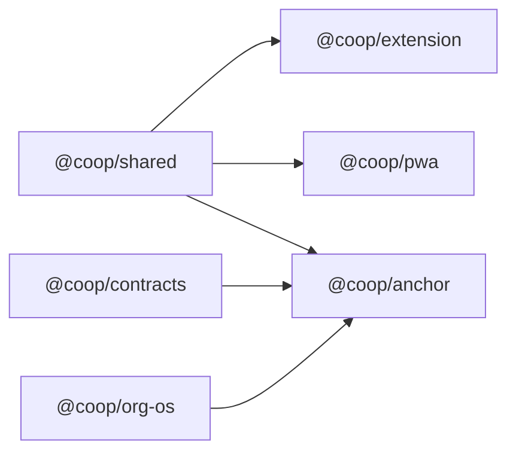

# Coop Component Development Plans

These plans build on the existing scaffold in the coop repo. Each section covers one package or subsystem, describes what already exists (from the initial scaffold pass), identifies gaps, and specifies exact implementation tasks.

**Current state summary**: 18 files with real logic, 7 stubs/placeholders, ~15 config files, ~15 doc/schema files. The extension and anchor server can run but have no real AI, no real storage, no real P2P, and several UI dead ends.

---

## Plan 1: Browser Extension (`packages/extension`)

### What Exists

- Manifest V3 with permissions for storage, tabs, activeTab, sidePanel
- Side panel UI (React): Coop create flow, tab capture button, voice dictation, activity feed
- Popup: static redirect to side panel
- Service worker: in-memory feed for `tab.captured`, `voice.transcribed`, `feed.get`
- Content script: captures page title/url/snippet on `coop.capture-page` message
- `MembraneClient`: WebSocket publish/subscribe connecting to `ws://localhost:8788`
- `indexeddb.ts`: IndexedDB wrapper for `coop-local-node` DB with `saveArtifact` / `listArtifacts`
- `anchor-client.ts`: stub WebSocket connect+send only

### Gaps and Required Work

**Build system fix** -- the Vite config builds sidepanel and popup HTML but the manifest points to `src/` paths. The extension cannot be loaded as-is.

- Add a Vite extension build plugin (CRXJS or custom rollup) that copies `manifest.json` to `dist/` and rewrites paths
- Build service worker and content script as separate entry points (they must be plain JS, not module bundles in MV3)
- Add `npm run build:extension` that produces a loadable `dist/` directory

**Join Coop flow** -- the "Join" button currently does nothing.

- Wire `joinCode` input to the anchor node: `POST /api/coops/join` with the share code
- On success, store Coop membership in IndexedDB (`coops` object store)
- Add a Coop selector dropdown that lists all joined Coops from IndexedDB
- Switch active Coop context (all captures tagged with active `coopId`)

**Service worker persistence** -- feed is in-memory and lost on extension reload.

- Replace `memoryFeed` array with IndexedDB writes (reuse the existing `indexeddb.ts` patterns)
- On `feed.get`, query IndexedDB instead of in-memory array
- Add per-Coop feed filtering

**Tab capture improvements**

- Extract richer content from pages: use [Readability.js](https://github.com/nickvdp/reader) or `document.cloneNode` to get article text
- Support multi-tab capture: "Add all tabs in window" button
- Show captured tab metadata in the feed (title, favicon, snippet preview)

**Drag-and-drop canvas** -- currently a placeholder div.

- Accept dropped URLs, text selections, and files
- Parse dropped content and send as `content.proposed` message to background
- Visual feedback: drop zone highlight, processing indicator

**AnchorClient integration** -- exists but is unused.

- Connect `AnchorClient` in the side panel on mount (alongside membrane)
- Use it to call `/api/skills/run` when the user requests processing
- Display skill results (summary + actions) in the feed

**Voice dictation refinements**

- Support continuous dictation mode (not just single utterance)
- Show live transcript as the user speaks
- Allow the user to select which Coop and pillar the transcript targets

### Key Files to Modify

- `packages/extension/vite.config.ts` -- add CRXJS or multi-entry build
- `packages/extension/manifest.json` -- adjust paths for dist output
- `packages/extension/src/sidepanel/main.tsx` -- Join flow, Coop selector, anchor skill calls, drag-drop
- `packages/extension/src/background/service-worker.js` -- IndexedDB persistence, Coop-scoped feeds
- `packages/extension/src/content/content-script.js` -- Readability extraction
- `packages/extension/src/lib/anchor-client.ts` -- receive handling, skill invocation

### Dependencies to Add

- `@nickvdp/reader` or `@mozilla/readability` (tab content extraction)
- `crxjs` or equivalent Vite extension plugin

---

## Plan 2: Anchor Node Backend (`packages/anchor`)

### What Exists

- Fastify HTTP server on port 8787 with routes: `/health`, `POST /api/skills/run`, `POST /api/storage/cold`
- WebSocket relay on port 8788 (broadcasts all messages to all connected clients)
- Agent runtime: dispatches to pillar handlers then runs inference, merges results
- Pillar handlers: four functions returning fixed template strings
- AI inference: returns truncated input, no LLM call
- Storacha: returns fake CID
- Key store: in-memory Map

### Gaps and Required Work

**Real AI inference** -- replace the stub with actual LLM calls.

- Integrate Anthropic Claude SDK (`@anthropic-ai/sdk`) for strong inference
- System prompt per pillar that instructs the model on expected output format
- Input: raw text from tabs, voice transcripts, or notes
- Output: structured JSON with `summary`, `actions[]`, `artifacts[]`
- Fall back to a simpler model (e.g., smaller Anthropic model) if key is missing
- Rate limiting per Coop

Implementation pattern from green-goods agent: single service module exporting inference functions, config-driven model selection.

**Real pillar processing** -- replace template returns in `pillars.ts`.

- `runImpactReporting`: extract activities, beneficiaries, outcomes from input; produce EAS-compatible attestation draft following Green Goods schema patterns; generate markdown impact summary
- `runCoordination`: parse meeting notes; extract decisions, action items with owners and deadlines; produce structured meeting record matching meetings.json-ld schema
- `runGovernance`: identify proposal topics; draft proposal with options and rationale; log decisions
- `runCapitalFormation`: detect funding mentions; match against known opportunities; draft application outlines

Each pillar handler calls `runInference` with a pillar-specific system prompt.

**Storacha / Filecoin integration** -- replace fake CIDs in `storacha.ts`.

- Install `@storacha/client` SDK
- On artifact approval, upload content blob to Storacha
- Return real CID and gateway URL
- Store CID mapping in a local SQLite or JSON file per Coop

**Coop management API** -- currently only skill execution and storage routes exist.

- `POST /api/coops` -- create a new Coop (generate share code, store metadata)
- `POST /api/coops/join` -- join by share code
- `GET /api/coops/:id` -- get Coop details and members
- `GET /api/coops/:id/feed` -- get processed artifacts for a Coop
- `POST /api/coops/:id/members` -- add member

**WebSocket protocol** -- currently a raw broadcast relay.

- Define message types: `coop.join`, `coop.leave`, `content.proposed`, `content.approved`, `skill.result`, `sync.request`, `sync.response`
- Route messages to the correct Coop room (not broadcast to all)
- Track connected clients per Coop
- Send `skill.result` back to the originating Coop members after processing

**Persistent key and Coop storage** -- replace in-memory stores.

- Use SQLite (via `better-sqlite3` or Bun's built-in SQLite) for Coops, members, keys, and artifacts
- Schema: `coops`, `members`, `api_keys`, `artifacts`, `skill_runs` tables

**CORS configuration** -- extension and PWA need to reach the anchor.

- Add `@fastify/cors` with allowed origins for `chrome-extension://` and `http://localhost:*`

### Key Files to Modify

- `packages/anchor/src/ai/inference.ts` -- Anthropic SDK integration
- `packages/anchor/src/agent/pillars.ts` -- real extraction logic per pillar
- `packages/anchor/src/storage/storacha.ts` -- Storacha SDK
- `packages/anchor/src/api/routes.ts` -- Coop CRUD routes
- `packages/anchor/src/server.ts` -- WS room routing, CORS, DB init
- `packages/anchor/src/auth/keys.ts` -- SQLite persistence

### Dependencies to Add

- `@anthropic-ai/sdk` (AI inference)
- `@storacha/client` (Filecoin storage)
- `better-sqlite3` (persistent storage)
- `@fastify/cors` (CORS)
- `@fastify/websocket` (optional: upgrade from raw `ws` to Fastify-native WS)

---

## Plan 3: PWA Companion (`packages/pwa`)

### What Exists

- Vite + React app with single `main.tsx`
- Coop share code input (unused)
- Voice recording via Web Speech API
- Recent transcriptions list (in-memory)

### Gaps and Required Work

**PWA manifest and service worker**

- Add `manifest.webmanifest` with name, icons, `display: standalone`, theme color
- Add VitePWA plugin (like green-goods) for Workbox service worker generation
- Configure offline caching strategy

**Anchor node connection**

- Add `MembraneClient` (reuse from extension's `p2p-membrane.ts` via `@coop/shared` or extract)
- Connect to anchor WebSocket on app mount
- Join Coop room using share code

**Voice-first UX** -- per meeting decision, PWA is optimized for pure voice dictation.

- Large, prominent microphone button as primary UI element
- Continuous dictation mode with live transcript preview
- Pillar selector (impact, coordination, governance, capital) before or after recording
- Submit transcript to anchor for processing via WebSocket or REST

**Coop membership persistence**

- Store joined Coops in IndexedDB (reuse shared storage layer)
- List joined Coops with last activity timestamp
- Push notification opt-in for new Coop activity (via service worker)

**Feed display**

- Show processed artifacts from anchor (skill results, summaries)
- Pull feed via `GET /api/coops/:id/feed` or receive via WebSocket
- Offline-queue voice notes for sync when back online

### Key Files to Create/Modify

- `packages/pwa/vite.config.ts` -- add VitePWA
- `packages/pwa/src/main.tsx` -- full rewrite with voice-first UX
- New: `packages/pwa/public/manifest.webmanifest`
- New: `packages/pwa/src/lib/anchor-connection.ts` -- WebSocket to anchor
- New: `packages/pwa/src/lib/storage.ts` -- IndexedDB for Coop membership and offline queue

### Dependencies to Add

- `vite-plugin-pwa` (PWA support)
- `idb-keyval` (IndexedDB convenience, matches green-goods pattern)

---

## Plan 4: Shared Package (`packages/shared`)

### What Exists

- Core types: `Coop`, `CoopMember`, `CoopSettings`, `Node`, `NodeIdentity`, `SkillDefinition`, `CoopMessage`
- `StorageLayer<T>` and `ThreeLayerStorage<T>` interfaces with `replicateToAllLayers`
- `MembraneTransport` and `ConsensusPolicy` interfaces; `AnchorAutoApproveConsensus`
- Barrel export in `index.ts`

### Gaps and Required Work

**Concrete storage backends** -- the interfaces exist but no implementations.

- `IndexedDBStorageLayer<T>`: implements `StorageLayer<T>` using IndexedDB (for extension and PWA)
- `RestStorageLayer<T>`: implements `StorageLayer<T>` by calling anchor REST API (for shared membrane layer)
- `StorachaStorageLayer<T>`: implements `StorageLayer<T>` for cold storage (calls anchor's `/api/storage/cold`)
- Factory: `createThreeLayerStorage(config)` that assembles the three concrete layers

**Unified membrane client** -- extension has `MembraneClient` in its own `lib/`, but it's not in `@coop/shared`.

- Move `MembraneClient` to `packages/shared/src/protocols/membrane-client.ts`
- Make it implement `MembraneTransport` interface
- Both extension and PWA import from `@coop/shared`

**Message protocol constants**

- Define all message types as a union enum in `protocols/message-types.ts`
- Add message creation helpers: `createTabCapturedMessage(...)`, `createVoiceTranscribedMessage(...)`, etc.
- Add message validation functions

**Coop management types**

- `CreateCoopRequest`, `JoinCoopRequest`, `CoopFeedItem`
- API response types matching anchor routes

**Skill execution types**

- `SkillRunRequest`, `SkillRunResult` types matching the anchor `/api/skills/run` contract
- Pillar-specific result shapes (impact report, coordination summary, etc.)

### Key Files to Create/Modify

- `packages/shared/src/storage/three-layer.ts` -- add concrete implementations
- New: `packages/shared/src/storage/indexeddb-layer.ts`
- New: `packages/shared/src/storage/rest-layer.ts`
- New: `packages/shared/src/storage/storacha-layer.ts`
- New: `packages/shared/src/protocols/membrane-client.ts` -- moved from extension
- New: `packages/shared/src/protocols/message-types.ts`
- `packages/shared/src/types/index.ts` -- add API and skill types

### Dependencies to Add

- `idb-keyval` (for IndexedDB layer implementation)

---

## Plan 5: Smart Contracts (`packages/contracts`)

### What Exists

- `CoopRegistry.sol`: `createCoop`, `addMember`, `getCoopsByMember`, events
- `pimlico.ts`: stub returning fake smart account address and session key
- `foundry.toml`: Solidity 0.8.26 config
- No tests, no deployment scripts, no ABI export

### Gaps and Required Work

**Contract enhancements**

- Add `removeMember(coopId, member)` function
- Add `updateMetadataURI(coopId, newURI)` for anchor-initiated metadata updates
- Add `getCoopInfo(coopId)` view returning full struct
- Add access control: allow both creator and designated admin roles
- Add interface `ICoopRegistry.sol` for type-safe integration

**Pimlico smart account integration** -- replace stub in `pimlico.ts`.

- Install `permissionless` and `viem` packages
- Create `SimpleAccount` via Pimlico bundler API
- Generate session keys with permission scopes: `gardens.propose`, `green-goods.attest`
- Store session key mapping per Coop in anchor's database
- Add `submitUserOperation` helper for agent-initiated transactions

**Deployment scripts**

- Create `script/deploy.ts` following green-goods pattern: CLI with `--network`, `--broadcast` flags
- Output deployment artifacts to `deployments/{chainId}-latest.json`
- Support Gnosis Chain (chainId 100) and Arbitrum (chainId 42161)

**ABI export for TypeScript**

- Generate TypeScript ABI constants from compiled artifacts
- Export from package for use by anchor and extension

**Tests**

- Foundry tests: `test/CoopRegistry.t.sol`
- Test: create coop, add member, query, access control, edge cases

### Key Files to Create/Modify

- `packages/contracts/src/CoopRegistry.sol` -- enhancements
- `packages/contracts/src/pimlico.ts` -- real Pimlico integration
- New: `packages/contracts/src/interfaces/ICoopRegistry.sol`
- New: `packages/contracts/script/deploy.ts`
- New: `packages/contracts/test/CoopRegistry.t.sol`
- New: `packages/contracts/deployments/` directory

### Dependencies to Add

- `permissionless` (ERC-4337 smart accounts)
- `viem` (Ethereum client)

---

## Plan 6: Org-OS Integration (`packages/org-os`)

### What Exists

- JSON-LD schemas: meetings, projects, finances, skills (copied from framework)
- `federation.yaml` configured for Coop with Regen Coordination network
- `generate-all-schemas.mjs`: copies schemas from hardcoded external path
- `setup-org-os.mjs`: creates minimal workspace seed
- Skill stubs: `meeting-processor/SKILL.md`, `knowledge-curator/SKILL.md`
- Template: `coop-onboarding.md`

### Gaps and Required Work

**Fix `generate-all-schemas.mjs`** -- hardcoded absolute path will break on any other machine.

- Change to relative path or make configurable via env var
- Better: copy schemas at repo setup time (npm `postinstall`), not at build time
- Or: vendor the schemas directly (they're already in `schemas/`, so remove the copy script and treat them as owned)

**Upgrade skills to full spec** -- current stubs are 10-18 lines; template skills are 88-138 lines.

Following the pattern from organizational-os-framework skill-specification.md and template skills:

- Add YAML frontmatter to each skill: `name`, `version`, `description`, `author`, `category`
- Add sections: "What This Is", "When to Use", "When NOT to Use", "Usage" (step-by-step), "Notes"
- Reference workspace paths where the skill reads/writes
- Add safety notes where applicable

**Fix federation.yaml skill name mismatches**

- `governance-assistant` in federation.yaml vs `governance` in `skills/` -- align to `governance`
- `capital-flow` in federation.yaml vs `capital-formation` in `skills/` -- align to `capital-formation`

**Enhance setup script** -- adapt from organizational-os-template setup script.

- Add interactive prompts for Coop-specific setup (using `@clack/prompts`)
- Collect: Coop name, description, region/bioregion, selected pillars, anchor node URL, member info
- Generate: `SOUL.md`, `IDENTITY.md`, `MEMORY.md`, initial `federation.yaml`, `.well-known/dao.json`

**Add data-driven schema generation** -- adapt from template's `generate-all-schemas.mjs`.

- Read `data/members.yaml`, meetings markdown, `data/projects.yaml`
- Generate `.well-known/*.json` files for EIP-4824 compliance
- Run via `npm run generate:schemas`

### Key Files to Modify

- `packages/org-os/scripts/generate-all-schemas.mjs` -- remove hardcoded path or vendor schemas
- `packages/org-os/scripts/setup-org-os.mjs` -- interactive Coop setup
- `packages/org-os/schemas/federation.yaml` -- fix skill names
- `packages/org-os/skills/meeting-processor/SKILL.md` -- upgrade to full spec
- `packages/org-os/skills/knowledge-curator/SKILL.md` -- upgrade to full spec

### Dependencies to Add (for setup script)

- `@clack/prompts` (interactive CLI)
- `gray-matter` (frontmatter parsing)
- `js-yaml` (YAML handling)

---

## Plan 7: Skills System (`skills/`)

### What Exists

Four skill stubs, each 10-15 lines with a short workflow description and no frontmatter:

- `impact-reporting/SKILL.md` -- most developed (4 steps, mentions Green Goods and cold storage)
- `coordination/SKILL.md` -- 3 steps
- `governance/SKILL.md` -- 3 steps
- `capital-formation/SKILL.md` -- 3 steps

### Gaps and Required Work

**Upgrade all skills to full specification** following skill-specification.md and the template skills pattern (88-138 lines each).

Each skill needs:

1. YAML frontmatter (`name`, `version: 1.0.0`, `description`, `author: coop`, `category`)
2. "What This Is" section
3. "When to Use" / "When NOT to Use"
4. Step-by-step "Usage" section with concrete instructions
5. Input/output format specification
6. Workspace file references
7. Integration notes

**Impact Reporting skill** (`skills/impact-reporting/SKILL.md`)

- Category: `operations`
- Inputs: tab captures (local government sites, project docs), voice transcriptions, meeting notes
- Processing: extract activities, beneficiaries, outcomes, evidence links
- Outputs: Markdown impact summary, EAS attestation draft payload, evidence CID list for cold storage
- Integration: Green Goods protocol, Storacha for evidence archival
- Workspace writes: `knowledge/impact/`, `data/attestations.yaml`

**Coordination skill** (`skills/coordination/SKILL.md`)

- Category: `coordination`
- Inputs: meeting transcripts, voice notes, shared tabs
- Processing: parse for decisions, action items, owners, deadlines
- Outputs: Structured meeting record, action items with assignees, weekly coordination summary
- Integration: org-os meeting-processor pattern
- Workspace writes: `packages/operations/meetings/`, `HEARTBEAT.md`

**Governance skill** (`skills/governance/SKILL.md`)

- Category: `governance`
- Inputs: discussion transcripts, shared position papers, prior decisions
- Processing: identify proposal topics, map options, assess consensus signals
- Outputs: Proposal draft, decision record, optional Gardens conviction voting proposal payload
- Integration: Gardens smart contract (via smart account session keys)
- Workspace writes: `knowledge/governance/`, `data/decisions.yaml`

**Capital Formation skill** (`skills/capital-formation/SKILL.md`)

- Category: `capital`
- Inputs: shared funding announcements, grant pages, financial docs
- Processing: detect opportunities, match to Coop capabilities and evidence
- Outputs: Opportunity brief, application draft outline, capital action queue
- Integration: org-os funding-scout pattern, Octant/Artisan/Gitcoin where applicable
- Workspace writes: `data/funding-opportunities.yaml`, `knowledge/capital/`

**Runtime integration** -- skills are defined as markdown but need to be loadable by the anchor agent.

- Each skill directory should also contain a `handler.ts` that exports a function the anchor runtime can call
- Handler receives structured input and returns structured output
- The anchor `runtime.ts` loads handlers dynamically based on skill name

### Files to Create/Modify

- `skills/impact-reporting/SKILL.md` -- full rewrite
- `skills/coordination/SKILL.md` -- full rewrite
- `skills/governance/SKILL.md` -- full rewrite
- `skills/capital-formation/SKILL.md` -- full rewrite
- New: `skills/impact-reporting/handler.ts`
- New: `skills/coordination/handler.ts`
- New: `skills/governance/handler.ts`
- New: `skills/capital-formation/handler.ts`

---

## Cross-Cutting Concerns

### Environment Configuration

- Create `.env.example` at repo root with all required variables:
  - `ANTHROPIC_API_KEY`
  - `STORACHA_TOKEN`
  - `COOP_ANCHOR_PORT`, `COOP_ANCHOR_WS_PORT`
  - `CHAIN_ID`, `RPC_URL`, `DEPLOYER_PRIVATE_KEY`
  - `PIMLICO_API_KEY`

### Monorepo Build Order

Update `turbo.json` to encode this dependency graph explicitly if needed.

### Testing Strategy

- **Contracts**: Foundry tests (`forge test`)
- **Anchor**: Vitest integration tests for routes and pillar handlers
- **Extension**: Manual testing in Chrome (load unpacked)
- **PWA**: Lighthouse PWA audit + manual voice testing
- **Shared**: Vitest unit tests for storage layers and message helpers

### Pre-Submission Checklist

- Extension loads in Chrome and captures tabs + voice
- Anchor processes input through at least one pillar with real AI
- Storacha upload returns real CID
- CoopRegistry deployed to testnet
- PWA installable with voice capture
- End-to-end demo flow: create Coop -> capture -> process -> archive
- README with setup instructions
- Demo video recorded
