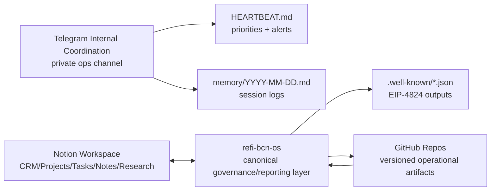

# ReFi BCN Channels & Systems Map

Date: 2026-03-07  
Status: Active operational map (human + AI use)

---

## 1) Quick Map

---

## 2) Core Channels (ReFi BCN)

| Channel/System | Scope | Main Purpose | Operator Mode | Canonical Layer |
|---|---|---|---|---|
| **Notion Workspace** | Internal + operational | Live CRM, Projects, Tasks, Notes, Research | Daily execution | Live operations layer |
| **Telegram Internal Group** | Internal core team | Fast coordination, decisions, blockers, requests | Daily coordination | Signal/input layer (must be logged when critical) |
| **GitHub Repos** | Internal + public artifacts | Versioned docs, data registries, schemas, code | Continuous documentation and release | Canonical repo history |

---

## 3) Notion Workspace Map (Operational Databases)

Root page:  
`https://www.notion.so/ReFi-Barcelona-1386ed0845cb80d99ab8e7de7ad5fb16`

| Database | ID | Operational Role | Local OS Link |
|---|---|---|---|
| ReFi BCN CRM | `2156ed08-45cb-815c-9a3a-000b46e37cb7` | Partners, ecosystem, relationship/funding context | `data/relationships.yaml`, selective links in `data/members.yaml` |
| Notes & Documents | `1386ed08-45cb-81ed-b055-000ba5b70a6b` | Weekly notes, meeting docs, operating context | `data/meetings.yaml`, `packages/operations/meetings/` |
| Projects | `1386ed08-45cb-8185-a48b-000bc4a72d53` | Active portfolio management | `data/projects.yaml`, `packages/operations/projects/` |
| Tasks | `1386ed08-45cb-8142-801b-000b2cb5c615` | Execution queue, due dates, dependencies | `HEARTBEAT.md` (urgent subset) |
| Research & Reading List | `1386ed08-45cb-814b-9193-000b605eb1e7` | Research inputs and references | `knowledge/` |
| Empenta work Hours count | `2f16ed08-45cb-8035-a2fc-000bb5e6f970` | Time tracking support | Referenced operationally (not core canonical registry) |

Integration note: `refi-bcn-openclaw` is connected.

---

## 4) Telegram Coordination Surface

| Surface | Purpose | Rule |
|---|---|---|
| ReFi BCN internal coordination group | Day-to-day coordination and decision signal | Critical decisions and commitments must be reflected in `MEMORY.md` / `HEARTBEAT.md` |
| ReFi DAO local node channels | Inter-node/network coordination | Extract actionable items into local project/task structure |
| Regenerant coordination channels | Program operations and deadlines | Reflect validated actions in meetings/tasks registries |

Operational principle: Telegram is a high-velocity signal channel; canonical decisions and tracking must land in repo files.

---

## 5) GitHub Repos (Operational Surface)

| Repo | Role | Notes |
|---|---|---|
| `refibcn/refi-bcn-os` | Primary ReFi BCN operational hub | Canonical OS workspace for human + AI coordination |
| `refibcn/ReFi-BCN-Website` | Public-facing website artifacts | External narrative/publishing surface |
| `luizfernandosg/Zettelkasten` | Wider knowledge context/workspace mirror | Cross-repo context and references |
| `regen-coordination/hub` | Federation/network coordination | Shared ecosystem alignment surface |

---

## 6) Traceability Rules (Mandatory)

1. Any high-impact instruction from Telegram/Notion must be mapped into local files (`HEARTBEAT.md`, `MEMORY.md`, `data/*`, `packages/operations/*`).
2. Sync updates must preserve source traceability (`source_refs` or explicit source note).
3. Completion evidence should be logged in `docs/FEEDBACK-ACTION-REGISTER.md` with file paths and commit hash.

---

## 7) Operator Quick Use

1. Open this map to identify channel/system ownership.
2. Check `docs/SOURCE-OF-TRUTH-MATRIX.md` before syncing data between systems.
3. Use `README.md` as the master entrypoint for current priorities and workflows.
