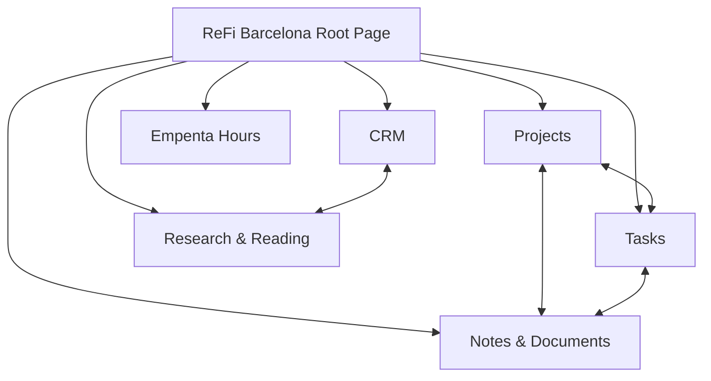

# Notion Workspace Map — ReFi BCN (Initial)

Date: 2026-03-07  
Status: Initial map (access validated)

## Visual Structure

## Root

- Workspace entry page: `ReFi Barcelona`
- URL: `https://www.notion.so/ReFi-Barcelona-1386ed0845cb80d99ab8e7de7ad5fb16`
- Page ID: `1386ed08-45cb-80d9-9ab8-e7de7ad5fb16`

## Key Data Sources (Operational)

### 1) ReFi BCN CRM
- Data source ID: `2156ed08-45cb-815c-9a3a-000b46e37cb7`
- Role: partner/contact pipeline and ecosystem relationship tracking
- Notable properties: `Name`, `Type`, `Focus Areas`, `Funding Time Window`, `What you seek`, `What you offer`, `Account owner`, `Organization`, `People`, `Email`, `Website`

### 2) Notes & Documents
- Data source ID: `1386ed08-45cb-81ed-b055-000ba5b70a6b`
- Role: operational notes, weekly sync docs, and program documentation
- Notable properties: `Title`, `Status`, `Date`, `Tags`, `Link`, `Projects`, `Tasks`

### 3) Projects
- Data source ID: `1386ed08-45cb-8185-a48b-000bc4a72d53`
- Role: active project portfolio and project hierarchy
- Notable properties: `Project name`, `Status`, `Owner`, `Assignee`, `Dates`, `Parent project`, `Sub-project`, `Tasks`, `Notes & Documents`

### 4) Tasks
- Data source ID: `1386ed08-45cb-8142-801b-000b2cb5c615`
- Role: execution queue and dependency tracking
- Notable properties: `Task name`, `Status`, `Priority`, `Due`, `Assignee`, `Project`, `Blocked by`, `Blocking`, `Archive?`, `Notes & Documents`

### 5) Empenta work Hours count
- Data source ID: `2f16ed08-45cb-8035-a2fc-000bb5e6f970`
- Role: time-tracking/work-hours support records
- Notable properties: `Name`, `Number`, `Select`

### 6) Research & Reading List DB
- Data source ID: `1386ed08-45cb-814b-9193-000b605eb1e7`
- Role: research repository and references, linked with CRM
- Notable properties: `Name`, `Tags`, `Relevance`, `Link`, `URL`, `file`, `📇 ReFi BCN CRM`

## Observed Relationship Model

- `Projects` ↔ `Tasks` ↔ `Notes & Documents` relations are actively used.
- `CRM` links to research records and (in some cases) activity notes.
- Nested page structure exists inside both records and standalone pages.

## Initial Alignment Targets (Notion ↔ Local OS)

- CRM entities ↔ `data/members.yaml` + `data/relationships.yaml`
- Projects DB ↔ `data/projects.yaml`
- Tasks DB ↔ `HEARTBEAT.md` + project task sections
- Notes & Documents ↔ `data/meetings.yaml` + `packages/operations/meetings/`
- Research DB ↔ `knowledge/`

## Next Mapping Steps

- Extract status taxonomies from Projects/Tasks/CRM and normalize to local conventions.
- Define canonical ID mapping strategy for records that do not yet have stable cross-system IDs.
- Identify which Notion databases are source-of-truth vs reporting layer.
- Build sync policy (manual, scripted, or hybrid) by object type.
