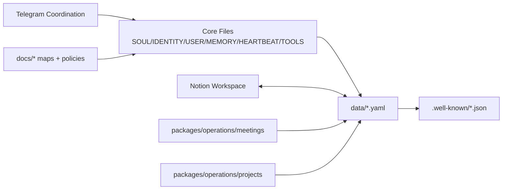

# ReFi BCN Workspace System Map

Date: 2026-03-07  
Status: Phase 1 — Initial Structural Research Complete

## Executive Summary

This document maps the complete operational workspace for ReFi BCN, spanning local Git-based Organizational OS files and the Notion cloud workspace. It identifies data flows, ownership boundaries, and alignment targets for the agent skill upgrade program.

For a communication/system-focused view (Notion + Telegram + GitHub), see: `docs/CHANNELS-AND-SYSTEMS-MAP.md`.

## System View (Visual)



---

## 1. Local Workspace Structure

### Core Identity & Configuration
| File | Purpose | Update Frequency |
|------|---------|------------------|
| `SOUL.md` | Values, mission, voice | Rarely (mission changes) |
| `IDENTITY.md` | Org identity, addresses, contacts | When governance changes |
| `USER.md` | Operator preferences (Luiz) | When preferences change |
| `AGENTS.md` | Agent operating manual | This alignment program |
| `TOOLS.md` | Integration endpoints, API refs | When tools change |
| `federation.yaml` | Network membership, peers, packages | Quarterly review |

### Data Registries (Source of Truth Candidates)
| Registry | Records | Purpose | Sync Status |
|----------|---------|---------|-------------|
| `data/members.yaml` | 3 core members | Core cooperative/team membership registry | ✅ Current (scope intentionally restricted to core team) |
| `data/projects.yaml` | 4 projects | Active projects with IDEA stages | ⚠️ Partial — Notion Projects has additional entries pending reconciliation |
| `data/meetings.yaml` | 6 meetings | Indexed operational meetings | ⚠️ Partial — Notion Notes has additional records to process |
| `data/finances.yaml` | 3 budgets, 1 expense, 3 revenues | Financial registry | ✅ Current (normalized values) |
| `data/relationships.yaml` | 9 entities, 9 relationships | Stakeholder relationship map | ✅ Current |
| `data/funding-opportunities.yaml` | 0 entries | Funding pipeline (to populate) | 📝 Empty — ready for population |

### Schema Outputs (Generated)
| File | Generated From | EIP-4824 Field |
|------|---------------|----------------|
| `.well-known/dao.json` | `IDENTITY.md` + `federation.yaml` | daoURI |
| `.well-known/members.json` | `data/members.yaml` | membersURI |
| `.well-known/projects.json` | `data/projects.yaml` | projectsURI |
| `.well-known/finances.json` | `data/finances.yaml` | financesURI |
| `.well-known/meetings.json` | `data/meetings.yaml` | meetingsURI |
| `.well-known/proposals.json` | (placeholder) | proposalsURI |
| `.well-known/activities.json` | (placeholder) | activityLogURI |
| `.well-known/contracts.json` | (placeholder) | contractsURI |

### Operational Packages
```
packages/operations/
├── meetings/
│   ├── templates/
│   │   ├── meeting-template.md
│   │   ├── standup-template.md
│   │   └── retrospective-template.md
│   └── scripts/
│       └── generate-meetings-uri.mjs
└── projects/
    └── templates/
        └── project-idea.md
```

### Knowledge Base
```
knowledge/
├── normalization-log.md          # Value conflict reconciliation log
└── refi-bcn-articulation-map.md  # Governance/funding bridge documentation
```

---

## 2. Notion Workspace Structure

### Root Entry Point
- **Page**: `ReFi Barcelona`
- **ID**: `1386ed08-45cb-80d9-9ab8-e7de7ad5fb16`
- **URL**: https://www.notion.so/ReFi-Barcelona-1386ed0845cb80d99ab8e7de7ad5fb16

### Data Sources (Operational Databases)

#### 2.1 ReFi BCN CRM
| Attribute | Value |
|-----------|-------|
| **ID** | `2156ed08-45cb-815c-9a3a-000b46e37cb7` |
| **Purpose** | Partner/contact pipeline, ecosystem relationships |
| **Properties** | 27 fields including: Name, Type, Focus Areas, Funding Time Window, What you seek/offer, Account owner, Email, Website, Maturity Level, Legal Entity |
| **Sample Entries** | Resilience.Earth, Cerulean Ventures, Coòpolis |
| **Estimated Records** | 50+ (based on search results) |

#### 2.2 Projects
| Attribute | Value |
|-----------|-------|
| **ID** | `1386ed08-45cb-8185-a48b-000bc4a72d53` |
| **Purpose** | Project portfolio tracking |
| **Key Properties** | Project name (title), Status (status), Owner (people), Assignee (people), Dates (date), Parent/Sub-project (relations), Tasks (relation) |
| **Status Options** | Backlog, and others (to be fully mapped) |
| **Sample Entry** | "IRL Events" — Status: Backlog |

#### 2.3 Tasks
| Attribute | Value |
|-----------|-------|
| **ID** | `1386ed08-45cb-8142-801b-000b2cb5c615` |
| **Purpose** | Execution queue, dependency tracking |
| **Key Properties** | Task name (title), Status (status), Priority (select), Due (date), Assignee (people), Project (relation), Blocked by/Blocking (relations), Archive? (checkbox), Tags (multi_select) |
| **Sample Entry** | "Coms Strategy - Gitcoin" — Status: Archived |

#### 2.4 Notes & Documents
| Attribute | Value |
|-----------|-------|
| **ID** | `1386ed08-45cb-81ed-b055-000ba5b70a6b` |
| **Purpose** | Meeting notes, operational docs, weekly syncs |
| **Key Properties** | Title (title), Status (status), Date (date), Tags (multi_select), Link (url), Projects/Tasks (relations), Created/Last edited metadata |

#### 2.5 Research & Reading List DB
| Attribute | Value |
|-----------|-------|
| **ID** | `1386ed08-45cb-814b-9193-000b605eb1e7` |
| **Purpose** | Research repository, references |
| **Key Properties** | Name (title), Link/URL, Tags, Relevance (select), File, CRM relation |

#### 2.6 Empenta Work Hours Count
| Attribute | Value |
|-----------|-------|
| **ID** | `2f16ed08-45cb-8035-a2fc-000bb5e6f970` |
| **Purpose** | Time tracking support |
| **Key Properties** | Name (title), Number (number), Select |

---

## 3. Cross-System Alignment Analysis

### Entity Mapping (Local ↔ Notion)

| Entity Type | Local System | Notion System | Alignment Status |
|-------------|--------------|---------------|------------------|
| **People/Contacts** | `data/members.yaml` (3 core members) | CRM database (50+) | ⚠️ Different scopes — local members are core team only; broader ecosystem stays in CRM/relationships |
| **Projects** | `data/projects.yaml` (4) | Projects database | ⚠️ Notion has more active projects |
| **Tasks** | `HEARTBEAT.md` checklist | Tasks database | 📝 Different paradigms — reconcile approach |
| **Meetings** | `data/meetings.yaml` (6) | Notes & Documents | ⚠️ Notion has additional meeting notes to ingest |
| **Funding Pipeline** | `data/funding-opportunities.yaml` (0) | CRM (Funding Time Window field) | 📝 Empty local registry — populate from CRM |
| **Research/Reading** | `knowledge/` markdown | Research DB | 📝 Different formats — consider bridge |

### Relationship Model Comparison

**Local OS (YAML-based)**
- Explicit `relationships.yaml` with typed relations
- Static, version-controlled
- Good for canonical stakeholder map

**Notion (Database relations)**
- Dynamic relations between CRM ↔ Projects ↔ Tasks ↔ Notes
- Real-time collaboration
- Better for active operational tracking

### Status/State Systems

| System | Project Status | Task Status | Notes |
|--------|---------------|-------------|-------|
| **Local OS** | IDEA stages (Integrate, Develop, Execute, Archive) | Checkbox in HEARTBEAT | Stable, versioned |
| **Notion** | Custom status (Backlog, + others TBD) | Custom status + Archive checkbox | Flexible, real-time |

**Alignment Challenge**: IDEA framework vs. Notion's flexible status system needs reconciliation for cross-system consistency.

---

## 4. Source of Truth Matrix

| Data Domain | Primary Source | Mirror/Report | Sync Direction | Rationale |
|-------------|----------------|---------------|----------------|-----------|
| **Stakeholder Registry** | Notion CRM | `data/members.yaml` | Notion → Local | Notion is actively maintained, has more entries |
| **Project Portfolio** | Notion Projects | `data/projects.yaml` | Notion → Local | Notion has active project management |
| **Project Tasks** | Notion Tasks | `HEARTBEAT.md` | Notion → Local | Notion has detailed task tracking |
| **Meeting Notes** | Notion Notes | `packages/operations/meetings/` | Notion → Local | Notion is where notes are taken |
| **Financial Data** | `data/finances.yaml` | Notion (if needed) | Local → Notion | Local has canonical normalized values |
| **Relationship Map** | `data/relationships.yaml` | Notion (via CRM fields) | Local → Notion | YAML allows complex relationship typing |
| **Funding Pipeline** | `data/funding-opportunities.yaml` | CRM research | Bidirectional | Build from CRM, enrich in YAML |
| **EIP-4824 Schemas** | `.well-known/*.json` | Generated | Auto | Always regenerate from sources |

---

## 5. Identified Gaps & Opportunities

### Immediate Gaps
1. **Empty funding pipeline** — `data/funding-opportunities.yaml` has 0 entries
2. **Stale meeting index** — `data/meetings.yaml` only has 3 entries vs. many in Notion
3. **Incomplete member registry** — Local only has 10 vs. 50+ in CRM
4. **Missing project mapping** — Notion Projects has entries not in local registry

### Workflow Opportunities
1. **Automated CRM → Members sync** — Pull partner/org data from Notion to YAML
2. **Meeting note processing** — Extract structured data from Notion notes to local ops files
3. **Task deadline monitoring** — Bridge Notion Tasks to HEARTBEAT alerts
4. **Funding pipeline automation** — Use CRM "Funding Time Window" + research DB to populate opportunities

### Structural Opportunities
1. **IDEA ↔ Notion status mapping** — Define translation layer between frameworks
2. **Relation preservation** — Maintain cross-references when syncing (CRM → Projects → Tasks)
3. **Canonical ID strategy** — Ensure stable identifiers across systems

---

## 6. Next Steps (Phase 1 Completion → Phase 2)

### Immediate (This Session)
- [x] Complete structural mapping (this document)
- [ ] Define IDEA ↔ Notion status translation
- [ ] Document canonical ID strategy

### Phase 2 (Next Sessions)
- [ ] Build CRM → Members sync workflow (skill upgrade)
- [ ] Build meeting note extraction workflow (skill upgrade)
- [ ] Build task deadline monitoring (skill upgrade)
- [ ] Populate funding pipeline from CRM + research

---

## Appendix: API-Ready Database IDs

For quick reference in scripts and API calls:

```yaml
notion_data_sources:
  crm: 2156ed08-45cb-815c-9a3a-000b46e37cb7
  notes_documents: 1386ed08-45cb-81ed-b055-000ba5b70a6b
  projects: 1386ed08-45cb-8185-a48b-000bc4a72d53
  tasks: 1386ed08-45cb-8142-801b-000b2cb5c615
  research_reading: 1386ed08-45cb-814b-9193-000b605eb1e7
  hours_count: 2f16ed08-45cb-8035-a2fc-000bb5e6f970

root_page: 1386ed08-45cb-80d9-9ab8-e7de7ad5fb16
```

---

*Document Status: Initial structural research complete. Ready for Phase 2 data model alignment and skill development.*
