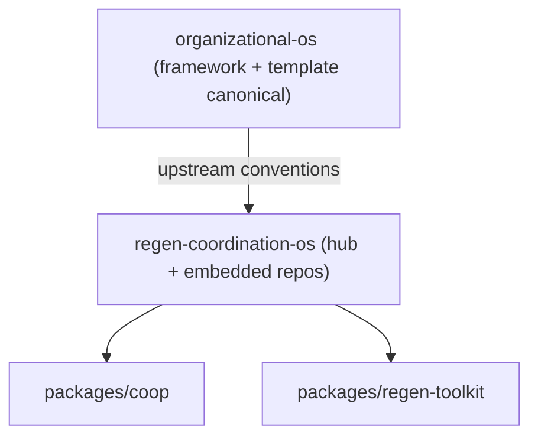
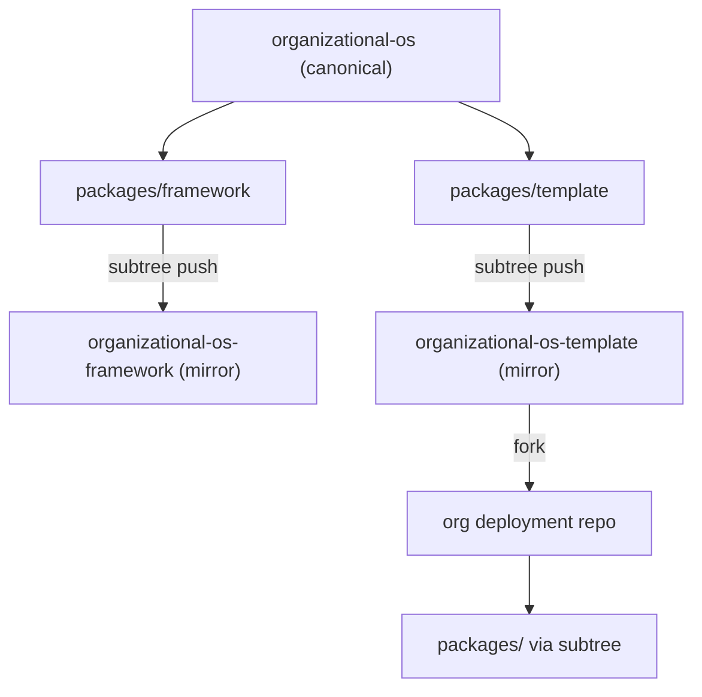
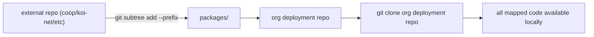

# Organizational-OS Monorepo Refactor

Standards: [DIAGRAM-STANDARDS.md](./DIAGRAM-STANDARDS.md)

## Context

Regen Coordination now maintains:
- `organizational-os` as the canonical monorepo
- `organizational-os-framework` as a standalone mirror
- `organizational-os-template` as a standalone mirror

Org deployment repos should map additional repos under `packages/` using `git subtree` so a single clone includes all mapped content.

## Current Separation of Roles

- `organizational-os` remains the canonical framework/template monorepo.
- `regen-coordination-os` is the operational hub and now embeds:
  - `packages/coop`
  - `packages/regen-toolkit`



## ASCII Map

```text
regen-coordination/organizational-os            (canonical)
|
|-- packages/framework                          (source for framework mirror)
|-- packages/template                           (source for template mirror)
|   |
|   `-- packages/                               (org-mapped repos via subtree)
|       |-- coop/
|       |-- koi-net/
|       `-- <org-tool>/
|
|-- scripts/subtree-sync.sh

regen-coordination/organizational-os-framework  (standalone mirror)
regen-coordination/organizational-os-template   (standalone mirror, forkable)

regen-coordination/<org-os-repo>                (fork/deployment repo)
`-- packages/<mapped-repo>/                     (subtree content is present after clone)
```

## Mermaid Flow



## Single-Clone Mapping Model



## Operational Notes

- Use `git subtree add --prefix packages/<repo-name> <repo-url> main --squash` to map repos.
- Use `git subtree push --prefix packages/<repo-name> <repo-url> main` to upstream changes.
- Do not use submodules for mapped repos if the goal is single-clone readiness.
- Keep `federation.yaml` upstream pointing to `regen-coordination/organizational-os` with `path: packages/template`.
