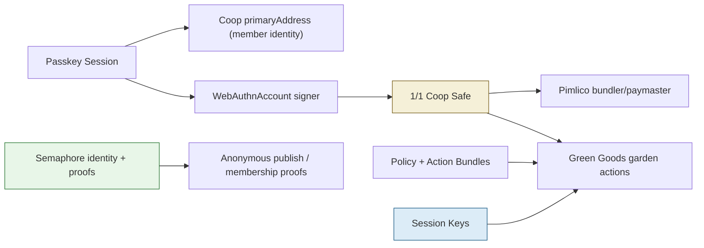
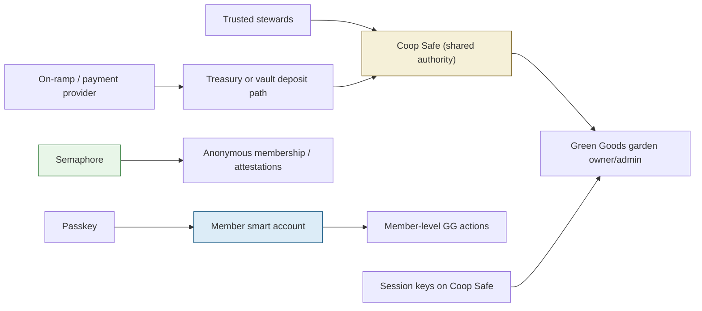

# Coop x Green Goods On-Chain Research

Date: 2026-03-20

Assumptions and terminology:
- "Pemco" in discussion likely means `Pimlico`
- "Paskey" likely means `passkey`
- "AppProto" likely means `AT Protocol`
- "kernel-based account extraction" is interpreted as issuing a user smart account layer, potentially with a Kernel-style account architecture

This memo separates:
- `Verified in repo`: behavior that is implemented in this codebase today
- `Recommendation`: architecture advice based on the repo and current external docs

## Executive Summary

The current Coop on-chain architecture is narrower than the product language around it.

What exists today:
- Coop uses passkey-first auth to derive a local member address and reconstruct a WebAuthn signer
- Coop deploys and executes a Safe smart account through ERC-4337 infrastructure using Pimlico
- In code, the Safe is currently instantiated with a single owner signer, not a true multi-owner threshold setup
- Green Goods support is real but bounded: garden bootstrap, profile sync, domain sync, pool creation, work approvals, assessments, and GAP admin sync
- Session keys exist, but only for a subset of non-financial Green Goods actions
- Semaphore is used for anonymous membership proofs and anonymous publishing, not for transaction signing

What does not exist yet:
- multiple Safe owners and threshold management flows
- a first-class per-member smart account issuance flow
- dedicated Green Goods actions for gardener lifecycle management
- impact/work artifact upload pipelines
- capital formation, vault deposit, treasury movement, or off-ramp flows

The clean target architecture is:
- Coop Safe for shared treasury, shared governance, and protocol-level admin actions
- per-user passkey smart accounts for members who need to act individually in Green Goods
- session keys for bounded automation only
- Semaphore for privacy and anonymous signaling, not signer control

## 1. Current On-Chain Architecture

### 1.1 Identity and signer stack

Verified in repo:
- `packages/shared/src/modules/auth/auth.ts` creates a passkey session and stores `primaryAddress`
- `derivePasskeyAddress()` deterministically derives that address from passkey credential material
- `restorePasskeyAccount()` reconstructs a viem `WebAuthnAccount` from the stored passkey
- `authSessionToLocalIdentity()` and `sessionToMember()` project that same `primaryAddress` into Coop identity/member records

Important nuance:
- the repo treats `authSession.primaryAddress` as the Coop member address
- the actual viem `WebAuthnAccount` used as the Safe owner is reconstructed separately
- because `primaryAddress` is derived by Coop code rather than read from `toWebAuthnAccount()`, it should be treated as Coop’s canonical member identity address, not automatically assumed to be the same thing as the signer object’s own internal address unless explicitly verified in runtime

Implication:
- the current architecture already has two address concepts in practice:
  - the Coop member identity address
  - the signer object used to own/control the Safe

That distinction matters when deciding how Green Goods should model gardeners, operators, and approval actors.

### 1.2 Safe deployment and execution

Verified in repo:
- `packages/shared/src/modules/onchain/onchain.ts` deploys the Coop Safe with:
  - `toSafeSmartAccount({ owners: [input.sender], version: '1.4.1', saltNonce })`
- `packages/shared/src/modules/greengoods/greengoods.ts` reconstructs the existing Safe with:
  - `toSafeSmartAccount({ owners: [sender], address: safeAddress, version: '1.4.1' })`
- execution is routed through Pimlico bundler/paymaster infrastructure

This means:
- the current Safe is effectively a `1/1` Safe in code
- Coop is not currently exercising Safe’s native multi-owner threshold model

### 1.3 Policy, sessions, and execution path

Verified in repo:
- all privileged actions are normalized into typed action bundles under `packages/shared/src/modules/policy/`
- Green Goods actions execute through the background action executor in `packages/extension/src/background/handlers/action-executors.ts`
- session keys are implemented in `packages/shared/src/modules/session/session.ts`
- session-capable Green Goods actions are limited to:
  - `green-goods-create-garden`
  - `green-goods-sync-garden-profile`
  - `green-goods-set-garden-domains`
  - `green-goods-create-garden-pools`

Verified implication:
- session keys currently power only the bounded, non-financial, garden-bootstrap/sync slice
- work approvals, assessments, and GAP admin sync are supported actions, but they are outside the session-capable set and therefore remain owner-Safe execution territory

### 1.4 Green Goods integration today

Verified in repo:
- `packages/shared/src/modules/greengoods/greengoods.ts` supports:
  - garden creation
  - garden profile sync
  - domain sync
  - pool creation
  - work approval attestations
  - assessment creation
  - GAP admin sync
- `docs/reference/green-goods-integration-spec.md` explicitly says Phase 1 excludes:
  - token transfers
  - approvals/allowances
  - cookie jar funding/withdrawals
  - marketplace actions
  - vault deposits/withdrawals
  - arbitrary contract calls

The current skill surface in `packages/extension/src/skills/` is:
- `green-goods-garden-bootstrap`
- `green-goods-garden-sync`
- `green-goods-work-approval`
- `green-goods-assessment`
- `green-goods-gap-admin-sync`

This is broader than the Phase 1 spec, but still far short of the full Green Goods protocol surface the product discussion is pointing toward.

### 1.5 How Coop currently relates to a Green Goods garden

Verified in repo:
- garden minting happens from the Coop Safe
- during bootstrap, `operatorAddresses` are resolved from Coop members with roles `creator` or `trusted`
- `gardenerAddresses` are resolved from all Coop members
- those addresses are passed into `mintGarden(... gardeners, operators ...)`

So the current model is:
- one Coop Safe is the garden-owning/admin address
- Coop member addresses are also inserted as gardeners/operators during garden creation

What is missing is a full member-account lifecycle for those addresses after bootstrap.

### 1.6 Semaphore and privacy

Verified in repo:
- `packages/shared/src/modules/privacy/` implements Semaphore v4 flows
- Coop can create privacy identities, membership groups, and anonymous publish proofs
- Bandada wrappers are present for durable group management

Verified architectural role:
- Semaphore is currently a privacy and anonymous signaling layer
- it is not wired into Safe ownership
- it is not a signer system
- it is not a Green Goods authorization system

### 1.7 Filecoin / FVM

Verified in repo:
- `packages/contracts/src/CoopRegistry.sol` is a small registry for archive and membership commitments
- `packages/shared/src/modules/fvm/fvm.ts` builds calldata for archive and membership registration
- there is no populated live deployment map for the registry

Implication:
- FVM is present as a partial or future extension, not a major active component of the current on-chain Green Goods flow

## 2. Current Architecture Diagram

## 3. Where The Current Architecture Does Not Match The Product Goal

### 3.1 "Multi-sig" currently means less than it sounds like

Verified in repo:
- the product copy and docs often say "Safe multisig"
- the code path is currently a single owner signer

Recommendation:
- stop using "multi-sig" as shorthand for "Safe exists"
- distinguish these clearly:
  - `Safe smart account`
  - `single-owner Safe`
  - `multi-owner threshold Safe`
  - `session key`
  - `member smart account`

That terminology cleanup is not cosmetic. It changes how the team reasons about authority.

### 3.2 Green Goods currently treats members as addresses, but does not provision those addresses as durable on-chain actors

Verified in repo:
- member addresses are used in bootstrap payloads
- there is no first-class user-account extraction/provisioning flow

Implication:
- if Green Goods requires gardeners to later report impact, upload work, receive allocations, or take individualized actions, Coop needs a formal per-member account layer

### 3.3 Current skills do not cover the full Green Goods lifecycle

Verified gap areas:
- no explicit add/remove gardener action surface
- no artifact upload or impact evidence packaging flow
- no vault deposit/withdraw flow
- no capital formation or treasury UX
- no full operator/admin lifecycle tooling

### 3.4 Semaphore is not the answer to signer management

Verified in repo:
- Semaphore is about private membership proofs

Recommendation:
- do not try to use Semaphore as a signer or Safe owner abstraction
- use it for:
  - anonymous endorsements
  - private attestations
  - privacy-preserving member gating
- do not use it for:
  - treasury control
  - user-operation signing
  - signer recovery
  - Safe owner replacement

## 4. Recommended Target Architecture

## 4.1 Split responsibilities by authority level

Recommendation:

| Layer | Recommended account type | What it should do |
|---|---|---|
| Coop treasury/governance | Safe smart account | Hold funds, own/admin protocol positions, execute shared approvals |
| Trusted automation | Safe session keys | Run narrow, pre-approved, replay-bounded actions |
| Individual member actions | Per-user smart account | Report impact, submit work, receive funds, sign personal actions |
| Privacy layer | Semaphore identity | Anonymous membership proofs and signaling |

This is the key design principle:
- shared authority lives on the Coop Safe
- personal authority lives on a member account
- privacy lives in Semaphore

Do not collapse those into one abstraction.

### 4.2 Should every member be a Safe owner?

Recommendation:
- no, not by default

Reasons:
- Safe owners are governance/tresury controllers, not just garden participants
- adding every gardener as a Safe owner creates heavy coordination and recovery overhead
- it blurs the distinction between "member of a coop" and "controller of the coop treasury"

Use Safe owners for:
- a small trusted steward set
- treasury and protocol-admin authority
- major governance or break-glass control

Use per-member smart accounts for:
- gardeners
- assessors
- contributors
- recipients
- people who need on-chain identity without treasury control

### 4.3 Do you need per-user smart accounts?

Recommendation:
- yes, if Green Goods requires individualized participation after garden bootstrap

That is the architectural gap your question is correctly pointing at.

Possible patterns:

1. `Safe-only model`
- keep one Coop Safe
- add member addresses to garden
- rely on off-chain approval plus limited owner actions
- simplest, but weak if users need their own durable on-chain agency

2. `Coop Safe + per-user smart accounts`
- Coop Safe remains garden owner/admin
- each member gets a passkey-backed smart account
- Green Goods can recognize members as actual on-chain actors
- this is the strongest fit for your stated direction

3. `Everyone becomes a Safe owner`
- technically possible
- operationally bad for non-Web3 communities
- not recommended except for a small steward council

### 4.4 Safe versus Kernel-style user accounts

Recommendation:
- if the goal is "simple passkey UX for non-Web3 users," both Safe and Kernel-style smart accounts can work
- the more important decision is not Safe versus Kernel, but whether you introduce a first-class member smart account layer at all

Pragmatic path:
- keep the Coop-level shared account on Safe, because that is already the repo’s core architecture
- add a per-user account provisioning module for members
- if you want maximal flexibility around passkeys, session keys, modular permissions, and routing/deposit UX, a Kernel-style account stack is a reasonable candidate
- if you want to stay close to the current codebase and avoid stack sprawl, per-user Safe smart accounts are also viable

My recommendation:
- do not replace the Coop Safe architecture
- add a member account architecture alongside it

### 4.5 Recommended target diagram

## 5. Concrete Product and Engineering Recommendations

### 5.1 Short-term: clean up authority boundaries

Recommendation:
- document three separate authority classes in product and code:
  - `Safe owners`
  - `session executors`
  - `member accounts`

Suggested immediate doc/code outcomes:
- rename UI copy that implies the current Safe is already a full multi-owner setup
- add internal docs for "who signs what"
- explicitly mark which Green Goods actions are:
  - Safe-owner only
  - session-key eligible
  - future member-account actions

### 5.2 Near-term: add member account provisioning

Recommendation:
- add a `memberOnchainAccount` record to Coop member state
- provision it when a member joins or when Green Goods is enabled
- keep the passkey as the default signer UX
- support recovery and rotation later

Minimum useful fields:
- `accountAddress`
- `accountType` (`safe` or `kernel` or generic `smart-account`)
- `ownerPasskeyCredentialId`
- `createdAt`
- `chainKey`
- `status`

### 5.3 Near-term: add Safe owner management flows only for trusted stewards

Recommendation:
- if you need true multi-owner treasury control, add dedicated owner management actions:
  - add owner
  - remove owner
  - swap owner
  - change threshold

Do not tie those to ordinary gardener membership.

### 5.4 Mid-term: expand Green Goods action coverage

Recommendation:
- add a next Green Goods scope that covers:
  - gardener add/remove
  - member-to-gardener reconciliation
  - work artifact packaging and upload
  - impact evidence submission
  - configurable assessment creation
  - treasury/vault entry points where protocol-safe

### 5.5 Mid-term: separate evidence storage from on-chain attestations

Recommendation:
- keep heavy evidence off-chain
- store references/CIDs on-chain
- use Storacha/IPFS/Filecoin, or potentially AT Protocol for social/public artifacts, but not as the sole canonical treasury system

That matches the existing Coop architecture better than trying to force large data payloads into Green Goods interactions.

## 6. Green Goods Capability Matrix

| Capability | Current status | Notes |
|---|---|---|
| Create garden | Implemented | Bounded action, session-key capable |
| Sync garden profile | Implemented | Session-key capable |
| Set garden domains | Implemented | Session-key capable |
| Create garden pools | Implemented | Session-key capable |
| Submit work approval | Implemented | Proposal-first, owner execution |
| Create assessment | Implemented | Proposal-first, owner execution |
| Sync GAP admins | Implemented | Owner execution, auto-detectable |
| Add/remove gardeners explicitly | Missing as first-class action | Bootstrap includes gardeners, lifecycle management does not |
| Upload work artifacts | Missing | No native artifact upload path in GG module |
| Upload impact evidence | Missing | No evidence packaging flow |
| Deposit into vaults | Missing | Explicitly out of current scope |
| Withdraw/capital movement | Missing | Explicitly out of current scope |
| Per-user account issuance | Missing | Core gap for individualized participation |

## 7. Funding Rails: On-Ramp and Off-Ramp Options

### 7.1 What the funding problem actually is

There are two different problems hidden inside "on-ramp/off-ramp":

1. retail community onboarding
- let a non-Web3 user buy or sell crypto with card/bank rails

2. treasury and capital formation workflow
- move community capital into protocol-controlled accounts and vaults with compliance, accounting, and payout support

Those do not always want the same provider.

### 7.2 Best options for simple community onboarding

#### Option A: Stripe Crypto Onramp

Best for:
- polished UX
- mobile/web embeds
- teams already comfortable with Stripe
- apps that want Stripe to handle merchant-of-record, KYC, fraud, and disputes

Tradeoffs:
- onramp-focused, not a complete treasury stack
- availability is still gated and preview-oriented in parts of the product
- geo and asset support are constrained

Assessment:
- strong option for inbound retail conversion into crypto
- not enough by itself for community treasury operations or comprehensive off-ramp

#### Option B: Transak

Best for:
- both on-ramp and off-ramp
- embedded widget flow
- partner-configurable parameters
- broad consumer onboarding use cases

Tradeoffs:
- widget/provider feel is more visible than Stripe’s deeply polished payment stack
- partner enablement and supported flows still need operational setup

Assessment:
- probably the most practical single-provider starting point if you want both directions and faster time-to-market

#### Option C: Ramp Network

Best for:
- strong SDK/web/mobile integration
- explicit off-ramp support
- native-flow integrations for better wallet-linked sell experience

Tradeoffs:
- still requires good integration discipline
- depending on region/use case, you may need to tune flow details carefully

Assessment:
- very credible option if off-ramp is important from day one

#### Option D: MoonPay

Best for:
- broad brand recognition
- on-ramp/off-ramp and swap-oriented user flows

Tradeoffs:
- commercial terms and integration shape may be less favorable depending on your exact product and geography

Assessment:
- worth evaluating commercially, but not the first choice I would make solely on technical grounds

### 7.3 Best option for protocol deposit simplification

Recommendation:
- if users need to fund vault deposits from arbitrary chains, CEX withdrawals, or fiat onramps that do not directly support your destination chain, also evaluate a smart routing/deposit-address layer

ZeroDev’s Smart Routing Address is notable here because it is explicitly designed for:
- receiving funds from CEX, fiat onramp, or any chain
- routing to a destination chain
- depositing into a vault-like or destination action flow

This is not a direct substitute for fiat on-ramp compliance. It is a UX bridge between where users have funds and where your protocol needs them.

### 7.4 My practical recommendation

If the goal is "make this simple for non-Web3 communities":

1. start with `Transak` or `Ramp` if you need both buy and sell early
2. use `Stripe Onramp` if inbound fiat-to-crypto UX is the top priority and your availability fits
3. add a routing/deposit-address layer only if capital needs to land on a destination chain or vault flow that the consumer onramp does not support directly

## 8. Legal Wrapper / Entity Path

This is not legal advice. It is an operational framing.

### 8.1 Simplest path: fiscal host first

Recommendation:
- if the main goal is to receive funds quickly and responsibly before a full legal structure is mature, a fiscal-host path is the simplest near-term option

Open Collective is relevant because it supports:
- hosted collectives under a fiscal host
- payment processor integration
- expense/admin flows
- later migration to an independent collective

This is the lowest-friction answer if you want:
- a legal wrapper now
- fewer entity-formation steps
- better transparency and admin support

### 8.2 Medium-complexity path: own entity, then integrate rails

Recommendation:
- if this is becoming a durable treasury with real capital formation, eventually form an entity and connect banking, tax, and payment flows directly

Typical options:
- LLC
- nonprofit/fiscal sponsorship path
- cooperative entity, if the governance model really is cooperative in law and not only in product metaphor

### 8.3 DAO LLC path

Recommendation:
- only use a DAO LLC structure if you are ready to do the governance, legal drafting, and liability work properly
- Wyoming DAO LLC is real, but it is not a shortcut around operational/legal complexity

Best framing:
- fiscal host first if speed and administrative simplicity matter
- own entity later when capital formation, treasury control, and contracting justify it

## 9. AT Protocol / Bluesky Implications

### 9.1 What AT Protocol changes

AT Protocol is relevant as:
- a distribution layer
- a public data layer
- an identity/discovery layer
- an observation/event ingestion layer

It is not a replacement for:
- Safe treasury control
- Green Goods signer authority
- vault accounting

### 9.2 Useful architecture framing

AT Protocol has:
- PDS-centered authenticated writes
- AppView/Relay infrastructure for reads and aggregation
- public firehose streams for network-wide event consumption

Practical implication for Coop:
- Bluesky/AT Proto is a good source of observations and public artifacts
- it is a weak foundation for treasury authorization

### 9.3 How it could fit

Recommendation:

Use AT Protocol for:
- public project updates
- social discovery and reputation
- public evidence posts
- lightweight records or blobs that point to deeper Coop/Storacha artifacts
- agent observation ingestion from the firehose

Do not use AT Protocol for:
- Safe owner authentication
- critical treasury approvals
- signer recovery or wallet authority

### 9.4 Auth implications

Current trajectory in Bluesky docs:
- OAuth is the intended long-term auth path
- app-password/session style patterns still exist in parts of the ecosystem and tooling

Practical recommendation:
- if Coop explores Bluesky integration, keep social auth and on-chain auth separate
- a user can link a Bluesky identity to a Coop profile
- that Bluesky identity should not become the root of treasury authority

### 9.5 Best-fit implementation idea

Recommendation:
- model AT Protocol as an optional adapter in the agent/observation layer
- let Coop ingest posts, blobs, or mentions as inputs to the review queue
- allow publications back out to AT Protocol for social visibility
- keep Green Goods and Safe actions under Coop’s current policy/approval/action-bundle system

## 10. Concrete Next Steps

### Recommended sequence

1. Clarify terminology in code/docs/UI
- distinguish Safe owner, member account, session key, and Semaphore identity

2. Add member smart account provisioning
- this is the most important missing primitive for the Green Goods direction you described

3. Add trusted-steward Safe owner management
- only if you actually want real multi-owner treasury control

4. Expand Green Goods action surface
- gardener lifecycle
- evidence upload
- impact reporting
- vault entry/exit planning

5. Choose a funding rail
- `Transak` or `Ramp` for dual-direction retail ramping
- `Stripe Onramp` if inbound UX is the highest priority

6. Decide legal wrapper
- fiscal host first for speed
- entity later for durable capital formation

## 11. Repo Sources

Internal repo files used for this memo:
- `CLAUDE.md`
- `docs/reference/green-goods-integration-spec.md`
- `docs/reference/policy-session-permit.md`
- `docs/reference/privacy-and-stealth.md`
- `packages/shared/src/modules/auth/auth.ts`
- `packages/shared/src/modules/auth/identity.ts`
- `packages/shared/src/modules/onchain/onchain.ts`
- `packages/shared/src/modules/greengoods/greengoods.ts`
- `packages/shared/src/modules/session/session.ts`
- `packages/shared/src/modules/privacy/*`
- `packages/shared/src/modules/policy/action-bundle.ts`
- `packages/extension/src/background/handlers/action-executors.ts`
- `packages/extension/src/background/handlers/session.ts`
- `packages/extension/src/runtime/agent-runner.ts`
- `packages/extension/src/skills/green-goods-*`
- `packages/contracts/src/CoopRegistry.sol`
- `packages/shared/src/modules/fvm/fvm.ts`

## 12. External Sources

Safe / account abstraction:
- [Safe smart account concepts](https://docs.safe.global/advanced/smart-account-concepts)
- [Safe passkeys tutorial (React)](https://docs.safe.global/advanced/passkeys/tutorials/react)
- [Safe passkey signer guide](https://docs.safe.global/home/passkeys-guides/safe-sdk)
- [Safe add owner transaction](https://docs.safe.global/reference-sdk-starter-kit/safe-client/createaddownertransaction)
- [Safe remove owner transaction](https://docs.safe.global/reference-sdk-starter-kit/safe-client/createremoveownertransaction)
- [Safe change threshold transaction](https://docs.safe.global/reference-sdk-starter-kit/safe-client/createchangethresholdtransaction)

Pimlico / ERC-4337 infra:
- [Pimlico docs](https://docs.pimlico.io/)

Kernel / routing / smart account UX:
- [ZeroDev Smart Routing Address](https://docs.zerodev.app/smart-routing-address)
- [ZeroDev session keys overview](https://docs.zerodev.app/sdk/plugins/session-keys)

Privacy:
- [Semaphore docs](https://docs.semaphore.pse.dev/)
- [Semaphore SDK](https://js.semaphore.pse.dev/)
- [Semaphore proof generation](https://js.semaphore.pse.dev/functions/_semaphore_protocol_proof.generateProof.html)
- [Bandada docs](https://docs.bandada.pse.dev/)

Funding rails:
- [Stripe Crypto overview](https://docs.stripe.com/crypto)
- [Stripe fiat-to-crypto onramp](https://docs.stripe.com/crypto/onramp)
- [Transak on-ramp and off-ramp](https://docs.transak.com/docs/sdk-on-ramp-and-off-ramp)
- [Transak off-ramp](https://docs.transak.com/docs/transak-off-ramp)
- [Ramp off-ramp](https://docs.rampnetwork.com/off-ramp)
- [Ramp SDK configuration](https://docs.rampnetwork.com/configuration)
- [MoonPay docs](https://dev.moonpay.com/)

Legal wrapper / fiscal hosting:
- [Open Collective fiscal hosts](https://documentation.opencollective.com/fiscal-hosts/fiscal-hosts)
- [Open Collective creating a collective](https://documentation.opencollective.com/collectives/creating-a-collective)
- [Open Collective setting up a fiscal host](https://documentation.opencollective.com/fiscal-hosts/setting-up-a-fiscal-host)
- [Wyoming DAO FAQ (Secretary of State)](https://sos.wyo.gov/Business/Docs/DAOs_FAQs.pdf)

AT Protocol / Bluesky:
- [AT Protocol overview](https://atproto.com/specs/atp)
- [AT Protocol sync / firehose](https://atproto.com/specs/sync)
- [Bluesky API Hosts and Auth](https://docs.bsky.app/docs/advanced-guides/api-directory)
- [Bluesky OAuth client implementation](https://docs.bsky.app/docs/advanced-guides/oauth-client)
- [Bluesky repo createRecord](https://docs.bsky.app/docs/api/com-atproto-repo-create-record)
- [Bluesky repo uploadBlob](https://docs.bsky.app/docs/api/com-atproto-repo-upload-blob)

## 13. Bottom Line

The current Coop architecture is solid for:
- a passkey-first Safe-controlled admin account
- bounded Green Goods garden operations
- policy-governed trusted-node execution
- privacy-preserving membership proofs

It is not yet a full community capital and member-account operating system.

If the roadmap is:
- add gardeners individually
- let members report impact and upload work
- bring fiat capital into protocol vaults
- keep UX simple for non-Web3 communities

then the next major primitive to add is not "more skills" alone.

It is:
- a formal per-member smart account layer,
- while keeping the Coop Safe as the shared treasury/admin account.
