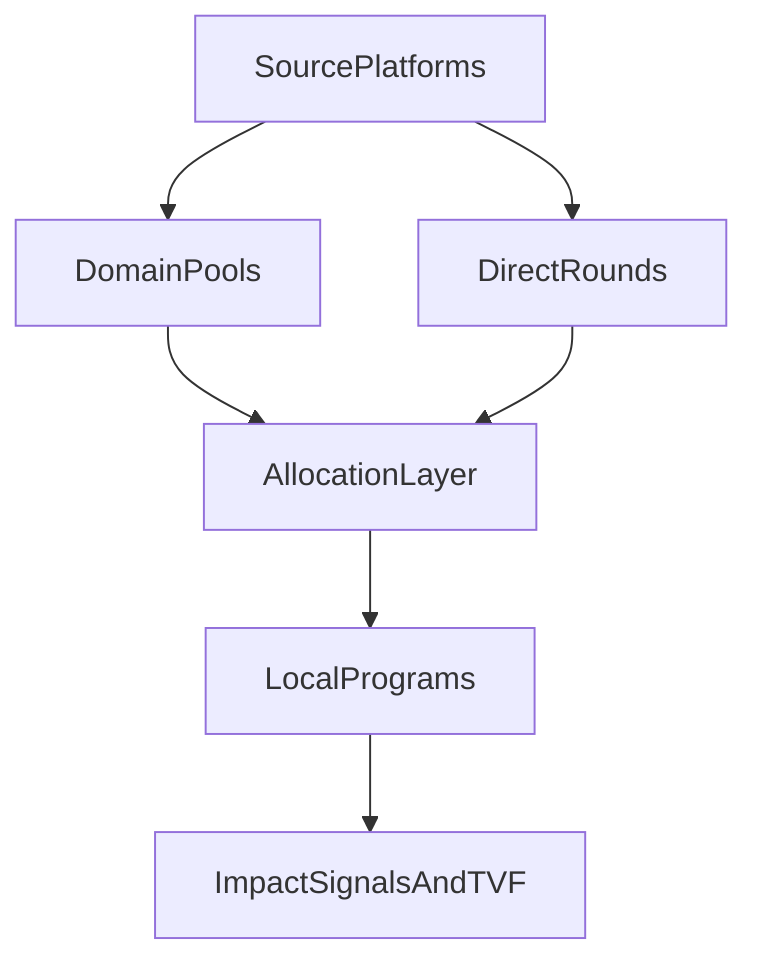

# Funding Opportunities

**Last updated:** 2026-03-06

---

## Active Platforms

| Platform | Type | Status | Notes |
|----------|------|--------|-------|
| Artisan Season 6 | artifact-based | active | $10M+ endowment; ~3 months |
| Octant Vaults | yield-protocol | active | ETH staking yield; need co-funders |
| Impact Stake | yield-protocol | active | 1/3-1/3-1/3 split in implementation; 10 ETH target |
| Superfluid Campaigns | streaming | active | Season 6 TBD; flow-based SUB tokens |
| Spinach Fry | yield | active | Monthly; ~$50/month ReFi DAO; Gardens-connected |
| Gardens Pools | governance-funding | active | $500 kickstarter for new nodes |
| Gitcoin / GG Rounds | quadratic-funding | periodic | — |
| Gitcoin GG24 Ethereum Localism DDA | domain-allocation | pipeline | DDA co-design track with OpenCivics and RC |

---

## Pipeline

| Platform | Status | Notes |
|----------|--------|-------|
| Celo Public Goods | pipeline | $350k H1 2025 |
| Arbitrum Grants | pipeline | — |
| Inverter Network | research | Similar to Octant; PrimeDow, Bloom, TEC |

---

## Domain Pool Strategy

- **Approach:** Domain-based first, bioregional later
- **Rationale:** Crypto-native funders more motivated by domain expertise
- **Candidate domains:** regenerative-finance, waste-management, agroforestry, local-governance
- **Governance layer:** StreamVote (trust-graph-based)
- **Impact accounting:** Karma Gap (inflows) + DAOIP-5 (outflows)
- **Target:** 3-4 funding sources for network sustainability (RC Council 2026-02-20)

---

## Funding Pipeline Diagram



```text
SourcePlatforms
   |- DomainPools ------\
   `- DirectRounds -----+--> AllocationLayer --> LocalPrograms --> ImpactSignalsAndTVF
```

---

## See Also

- `data/funding-opportunities.yaml` — machine-readable registry
- `skills/funding-scout/` — agent skill for tracking opportunities
