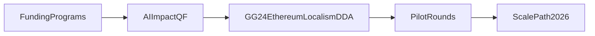

# Active Programs

**Last updated:** 2026-03-06

---

## Funding Programs

| Program | Type | Status | Duration |
|---------|------|--------|----------|
| Artisan Season 6 | artifact-based | active | ~3 months |
| Octant Vaults | yield-protocol | active | ongoing |
| Impact Stake | yield-protocol | active | 1/3-1/3-1/3 split in implementation |
| Superfluid Campaigns | streaming | active | Season 6 TBD |
| Spinach Fry | yield | active | monthly renewal |
| Gardens Conviction Voting | governance-funding | active | ongoing |
| Celo Public Goods | grants | pipeline | $350k H1 2025 |
| Arbitrum Grants | grants | pipeline | — |
| AI ImpactQF | funding-methodology | active | 50/50 COCM + impact scoring model (GG23 -> GG24) |
| Gitcoin GG24 Ethereum Localism DDA | domain-allocation | pipeline | Co-design with OpenCivics and ecosystem partners |

---

## Program Flow



```text
FundingPrograms -> AIImpactQF -> GG24DDA -> PilotRounds -> ScalePath2026
```

---

## Coordination Programs

| Program | Networks | Status |
|---------|----------|--------|
| Local ReFi Toolkit | RC | active |
| Regenerant Catalunya | ReFi BCN, RC | active |
| Knowledge Commons | RC | active |
| Coop | RC | active (hackathon-prototype) |

---

## See Also

- `data/programs.yaml` — machine-readable registry
- `knowledge/network/funding/` — funding opportunities
